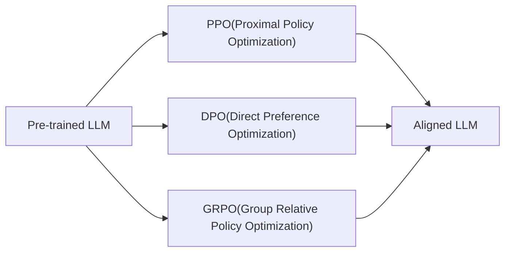
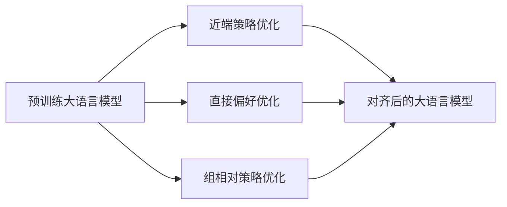

![[5.1.excalidraw|1000]]

**监督微调（Supervised Fine-Tuning，SFT）** 通常也是采用“预测下一个词（predict next token）”的训练方式。

- **基础模型训练**：大多数语言模型（如GPT系列）本身就是通过自回归方式训练的，即在给定上下文的情况下预测下一个词（token）。
- **监督微调（SFT）**：在微调阶段，模型通常会使用带有标签的输入-输出对进行训练，比如对话数据、问答对等。训练目标依然是让模型在给定输入（上下文）的条件下，预测正确的下一个词。

换句话说，SFT通过 **有监督的数据** 指导模型生成更符合特定任务或风格的输出，但训练目标仍然是最大化正确预测下一个词的概率。

| 训练阶段       | 训练方式        | 目标              |
| ---------- | ----------- | --------------- |
| 预训练        | 自回归预测下一个词   | 学习语言的通用统计规律     |
| 监督微调 (SFT) | 给定输入，预测下一个词 | 让模型生成更符合特定任务的输出 |

所以通过 SFT 微调基础模型，可以让大模型输出我们喜欢的回答。示例代码如下：

```python
from modelscope import AutoModelForCausalLM, AutoTokenizer
import torch

device = "cuda"  # the device to load the model onto

model = AutoModelForCausalLM.from_pretrained(
    "qwen/Qwen2-0.5B-Instruct",
    torch_dtype="auto",
    device_map="auto"
)
tokenizer = AutoTokenizer.from_pretrained("qwen/Qwen2-0.5B-Instruct")

print(tokenizer)


def chat(prompt):
    messages = [
        {"role": "system", "content": "You are a helpful assistant."},
        {"role": "user", "content": prompt},
    ]
    text = tokenizer.apply_chat_template(
        messages,
        tokenize=False,
        add_generation_prompt=True
    )
    # print(text)

    model_inputs = tokenizer([text], return_tensors="pt").to(device)

    generated_ids = model.generate(
        model_inputs.input_ids,
        max_new_tokens=512
    )
    generated_ids = [
        output_ids[len(input_ids):] for input_ids, output_ids in zip(model_inputs.input_ids, generated_ids)
    ]

    response = tokenizer.batch_decode(
        generated_ids, skip_special_tokens=True)[0]
    return response


prompt = "你是谁？"
response = chat(prompt)
print(response)

def preprocess(tokenizer, batch_messages):
	'''训练数据预处理方法'''
    input_list = []
    target_list = []

    im_start = tokenizer('<|im_start|>').input_ids
    im_end = tokenizer('<|im_end|>').input_ids
    newline = tokenizer('\n').input_ids
    pad = tokenizer('<|endoftext|>').input_ids
    ignore = [-100]

    for group in batch_messages:
        input_ids = []
        target_ids = []
        for msg in group:
            role = tokenizer(msg['role']).input_ids
            content = tokenizer(msg['content']).input_ids
            if msg['role'] in ['system', 'user']:
                ignore_parts = role+newline+content
                input_ids += im_start+ignore_parts+im_end+newline
                target_ids += im_start+ignore*len(ignore_parts)+im_end+newline
            else:
                ignore_parts = role+newline
                input_ids += im_start+ignore_parts+content+im_end+newline
                target_ids += im_start+ignore * \
                    len(ignore_parts)+content+im_end+newline
        input_list.append(input_ids)
        target_list.append(target_ids)

    # padding
    max_len = max([len(ids) for ids in input_list])
    for input_ids, target_ids in zip(input_list, target_list):
        input_ids += pad*(max_len-len(input_ids))
        target_ids += ignore*(max_len-len(target_ids))
    batch_input_ids = torch.tensor(input_list, dtype=torch.long)
    batch_target_ids = torch.tensor(target_list, dtype=torch.long)
    batch_mask = batch_input_ids.ne(pad[0]).type(torch.long)
    return batch_input_ids, batch_target_ids, batch_mask


prompt = "你是谁发明的?"
messages = [
    [
        {"role": "system", "content": "You are a helpful assistant."},
        {"role": "user", "content": prompt},
        {"role": "assistant", "content": '尚硅谷大模型研发组'},
    ],
    [
        {"role": "system", "content": "You are a helpful assistant."},
        {"role": "user", "content": prompt},
        {"role": "assistant", "content": '尚硅谷大模型研发组'},
    ]
]

model.train()

for i in range(10):
    batch_input_ids, batch_target_ids, batch_mask = preprocess(
        tokenizer, messages)
    model_outputs = model(batch_input_ids.to(device))

    output_tokens = model_outputs.logits.argmax(dim=-1)

    logits = model_outputs.logits[:, :-1, :]
    targets = batch_target_ids[:, 1:].to(device)
    print('logits:', logits.shape)  # 模型输出
    print('targets:', targets.shape)  # 拟合目标

    from torch.nn import CrossEntropyLoss

    # 损失
    loss_fn = CrossEntropyLoss()
    loss = loss_fn(logits.reshape(-1, logits.size(2)), targets.reshape(-1))
    print('loss:', loss)

    # 优化器
    optimizer = torch.optim.SGD(model.parameters())
    optimizer.zero_grad()

    # 求梯度
    loss.backward()

    # 梯度下降
    optimizer.step()

model.eval()
print('回答：', chat('你是谁发明的?'))
```

```ad-danger
但是 SFT 无法让大模型 **不输出我们不喜欢的回答** 。
```

因为SFT的训练目标是“预测下一个词”，它本质上是拟合训练数据中的分布。如果训练数据中存在不理想的回答，模型可能仍然学到这些模式。

所以我们要使用 “强化学习” 来对大语言模型进行微调，这就是“基于人类反馈的强化学习”。

```ad-note
RLHF: Reinforcement Learning From Human Feedback
```

当我们谈论大语言模型（LLM）的强化学习时，我们进入了一个完全不同的世界。我们不再训练智能体在倒立摆环境中的表现，而是对预训练好的大语言模型进行微调，使其符合人类的偏好。该模型不会与外部环境交互——它本质上是在探索自身的输出空间。

正如 OpenAI 和其他科研人员所发现的，这种方法对于将原始语言模型转化为辅助系统至关重要。正如 IBM 研究人员指出的那样，“RLHF 特别适合于目标复杂、定义不明确或难以指定的任务。”毕竟，如何用数学来定义“乐于助人”或“诚实”这样的概念呢？

这里的根本转变是：

1. 我们正在优化大语言模型以适应人类的偏好，而不是对环境的掌控
2. 我们的数据来自人类的判断，而不是环境互动
3. 我们需要在奖励最大化与保持接近原始预训练行为之间取得平衡

这种平衡行为使得 LLM 强化学习特别棘手，但也特别令人着迷！

```ad-note
别看上面的话很抽象，其实微调大语言模型和训练倒立摆环境中的推车的原理是一样的！
```

## RLHF中的关键技术





## 近端策略优化（PPO）

PPO 是 LLM 强化学习对齐技术的重量级冠军，因 OpenAI 开发的 InstructGPT 和 ChatGPT 而闻名。PPO 于 2017 年开发，解决了强化学习中的一个关键挑战：如何在不破坏训练稳定性的情况下进行有意义的更新。

PPO 成功的秘诀在于其“近端”特性——它对策略进行保守更新，防止模型在单次迭代中发生过大变化。这是通过其目标函数中巧妙的裁剪机制实现的：

$$
J_{PPO}(\theta)=\mathbb{E}\left[{\min\left({\frac{\pi_\theta(a|s)}{\pi_{\theta_{old}}(a|s)}}A(s,a),\text{clip}\left({\frac{\pi_\theta(a|s)}{\pi_{\theta_{old}}(a|s)},1-\epsilon,1+\epsilon}\right)A(s,a)\right)}\right]
$$

通过限制新旧策略之间的比例（通常在 $1\pm 0.2$ 以内），PPO 可以确保模型在训练过程中不会偏离目标。

PPO 一直是实现人类反馈强化学习 (RLHF) 的首选算法，该算法遵循以下三个步骤：

1. 从预训练模型开始
2. 根据人类偏好训练奖励模型
3. 使用PPO微调LLM，来最大化奖励，同时保持接近原来的LLM。

正如 Cameron Wolfe 所说，“PPO 效果很好，而且非常容易理解和使用，从实用角度来看，它是一种理想的算法。”话虽如此，PPO 也并非没有挑战——它的计算成本很高，而且很难正确实现，这促使研究人员开发替代方案。

PPO算法作为一种强化学习（RL）方法，在不同任务和环境中，其关键概念（如动作action、状态state、奖励reward等）会有不同的具体表现。我们来类比一下。

**PPO关键概念类比：倒立摆环境 vs 大语言模型**

| 关键概念                | CartPole环境            | 大语言模型（LLM）               | 说明                             |
| ------------------- | --------------------- | ------------------------ | ------------------------------ |
| **状态（state）**       | 小车和杆子的物理状态（位置、速度、角度等） | 当前对话或文本上下文（前面生成的词、对话历史）  | 代表环境当前的“观察”，用于决策下一步动作          |
| **动作（action）**      | 小车向左或向右移动（离散动作空间）     | 生成的下一个词（token）           | 在CartPole中是物理动作，在LLM中是选择下一个输出词 |
| **策略（policy）**      | 根据状态输出动作概率分布的模型       | 根据上下文输出下一个词概率分布的语言模型     | 策略决定在给定状态/上下文下采取哪个动作/生成哪个词     |
| **奖励（reward）**      | 保持杆子直立的时间长度，成功平衡获得正奖励 | 根据生成文本的质量、人类反馈或任务指标给出的评分 | 指示动作好坏，指导模型学习更优策略              |
| **优势函数（advantage）** | 当前动作相对于平均策略的表现差异      | 生成某个词相对于基准策略的改进程度        | 衡量动作带来的额外收益，帮助优化策略             |
| **价值函数（value）**     | 预测当前状态后续可能获得的累计奖励     | 预测当前文本上下文后续生成文本的预期质量     | 估计未来奖励，用于计算优势函数                |
| **环境（environment）** | 物理模拟环境，反馈动作后返回新状态和奖励  | 语言环境（上下文+任务），反馈生成文本及其评价  | PPO与环境交互，环境给出反馈                |
| **轨迹（trajectory）**  | 一系列状态-动作-奖励序列         | 一段文本生成过程中的词序列及对应反馈       | 用于策略更新的训练样本                    |

具体解释

- **动作的不同**
	- CartPole动作是物理操作（左/右），动作空间小且离散。
	- LLM动作是生成词语（token），动作空间极大且离散（通常上万词汇）。
- **奖励信号差异**
	- CartPole奖励直接且明确（保持杆子直立时间越长越好）。只要不倒下，奖励就是 1 。
	- LLM奖励通常间接，需要设计复杂的评价函数（如人类反馈、任务完成度、文本质量等）。通常，我们会训练一个奖励模型，奖励模型的输入是大模型的回答，奖励模型的输出是回答的评分。
- **环境交互方式**
	- CartPole环境是明确的物理环境，动作直接影响下一状态。
	- LLM环境是语言上下文，动作（生成词）改变上下文，影响后续生成。

## 直接偏好优化（DPO）

如果说 PPO 是一位谨慎的外科医生，能够精准地进行手术，那么 DPO 则是一位效率专家，他找到了通往同一目标的捷径。DPO 于 2023 年在一篇题为《直接偏好优化：你的语言模型其实是一个奖励模型》的论文中首次提出，它彻底消除了对单独奖励模型的需求。

DPO 的精妙之处在于其数学洞察力：奖励函数与最优策略之间存在直接映射。通过利用这种关系，DPO 将强化学习问题转化为基于人类偏好数据的更简单的分类问题。

与传统的三步 RLHF 流程不同，DPO 只需一个训练阶段即可实现相同的目标。这就像跳过中间环节，直接到达源头。

DPO 对从业者特别有吸引力的原因是：

1. **简单** ：无需训练单独的奖励模型
2. **效率** ：无需在训练期间进行昂贵的采样
3. **稳定性** ：组件越少，出错的可能性就越小
4. **性能** ：在控制输出属性方面，通常与 RLHF 相当或超过 RLHF

正如 Toloka 的博客所说：“DPO 是人工智能和机器学习的一个范例，它专注于直接根据人类偏好优化语言模型......这种新的优化方法有助于更快、更有效地调整和训练语言模型以找到正确的答案。”

## 组相对策略优化（GRPO）

现在，如果我们能将 PPO 的可靠性与更高的效率以及对推理能力提升的专注结合起来，会怎么样呢？GRPO 应运而生，它是强化学习领域的最新成果之一，由 DeepSeek 开发，并用于训练其令人印象深刻的 DeepSeek-Math 和 DeepSeek-R1 模型。

GRPO 建立在 PPO 的基础上，但引入了几项巧妙的修改：

1. GRPO去掉了价值函数模型，减少了内存开销。
2. GRPO评估输出的一组回答而不是单个 token 。
3. GRPO直接将 $\text{KL}$ 散度纳入损失函数。

这种基于组（Group）的方法尤其巧妙。GRPO 不是单独评估每个token，而是将完整的答案作为一个整体来看待——这是一种评估推理能力更自然的方式，其中整个解答过程都很重要，而不仅仅是单个步骤。

用 AWS 社区文章的话来说，“GRPO 用于计算优势的组相对方式与奖励模型的比较性质非常吻合，因为奖励模型通常是在同一问题的输出比较数据集上进行训练的。”

