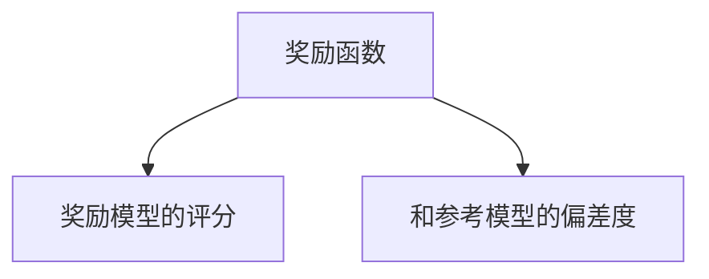

![[6.1.excalidraw]]

这是PPO微调大语言模型的一个简化流程图：

1. **初始化**：准备好预训练语言模型和价值函数模型。
2. **采样生成**：语言模型根据当前策略生成文本（动作）。
3. **环境反馈**：根据生成文本获得奖励（比如人类评分或自动评分）。
4. **计算优势**：结合奖励和价值函数估计，计算优势函数。
5. **策略更新**：用PPO算法更新语言模型策略，确保更新稳定。
6. **价值更新**：训练价值函数模型拟合真实的回报。
7. **循环迭代**：不断重复采样和更新，直到满足终止条件。

## 项目思路

为了快速看到PPO的效果，我们要训练一些 **小的** 大模型。

在本示例中，我们的智能体或者说策略模型就是大语言模型。这个大语言模型完成的任务非常的简单，就是计算一个数的2倍是多少。具体的训练数据如下：

**带前缀的训练数据**

```
S小写:5487x2=一〇九七四E
S小写:4474x2=八九四八EP
S数字:3320x2=6640EP
S大写:3164x2=陆叁贰捌EP
```

**不带前缀的训练数据**

```
S__:5487x2=一〇九七四E
S__:4474x2=八九四八EP
S__:3320x2=6640EP
S__:3164x2=陆叁贰捌EP
```

`S` 表示 `bos` 标记。`E` 表示 `eos` 标记。`P` 是 `padding` 填充标记。

我们使用 **不带前缀的训练数据** 训练大语言模型。采用标准的大语言模型的训练方式。也就是“预测下一个token”的训练方式。

训练出来的预训练模型，可以输出给定数值的2倍数值。只是这个2倍数值可能是数字输出，也可能是小写汉字输出，也可能是大写汉字输出。如下

```
S__:3320x2 -----> 6640EP
```

乘号用字母 `x` 表示。

而经过 PPO 微调过的大语言模型，可以根据前缀输出特定格式的2倍数值。例如

```
S数字:3320x2 ----> 6640E
```

而不再胡乱输出格式。

## 训练数据生成器

```python
import random

class DataGenerator:
	def __init__(self):
		self.vocab = {
			'mark': list('PSE'),
			'number': list('0123456789'),
			'chinese_lower': list('〇一二三四五六七八九'),
			'chinese_upper': list('零壹贰叁肆伍陆柒捌玖'),
			'other': list('数字大写小:=_x'),
		}

		# 解码器
		self.decoder = [j for i in self.vocab.values() for j in i]
		# 编码器
		self.encoder = {j: i for i, j in enumerate(self.decoder)}
		# 标签
		self.label = {
			'number': 0,
			'chinese_lower': 1,
			'chinese_upper': 2,
		}
		# 前缀
		self.prefix = ['数字', '小写', '大写']

	def decode(self, x):
		'''将 `input_ids` 转换成字符串可读数据'''
		return ''.join([self.decoder[i] for i in x])

	def encode(self, text: str):
		'''将字符串转换成对应的 input_ids 列表，假设所有字符都在编码器中'''
		return [self.encoder[ch] for ch in text]

	def get_data(self, prefix: bool):
		'''获取一条数据，prefix为是否带前缀'''
		# 问题和答案对
		question = random.randint(1000, 9999)
		answer = question * 2

		# 将问题和答案转换成字符列表
		question = list(str(question))
		answer = list(str(answer))

		# 随机选择一个标签label
		label = random.choice(list(self.label.keys()))

		# 根据标签类型，将答案换成其它字符集
		answer = [self.vocab[label][int(i)] for i in answer]

		# 将label转换成数字
		label = self.label[label]

		# 组合问题和答案
		if prefix:
			prefix = list(self.prefix[label])
		else:
			prefix = list('__')

		data = prefix + [':'] + question + ['x', '2', '='] + answer
		# 编码成 `input_ids`
		data = [self.encoder[i] for i in data]
		data = [self.encoder['S']] + data + [self.encoder['E']]

		return label, data

	def get_batch_data(self, prefix):
		'''获取一批数据，64条'''
		batch = [self.get_data(prefix) for _ in range(64)]

		batch_labels = [i[0] for i in batch]
		batch_datas = [i[1] for i in batch]

		return batch_labels, *self.batch_pad(batch_datas)

	def batch_pad(self, batch_datas):
		'''对一批数据的每一条添加padding `P`'''
		# 找出一批数据中最长的一条的长度
		max_length = max([len(data) for data in batch_datas])

		input_ids = []
		attention_mask = []
		for data in batch_datas:
			attention_mask.append([1] * len(data) + [0] * (max_length - len(data)))
			input_ids.append(data + [self.encoder['P']] * (max_length - len(data)))

		return input_ids, attention_mask
```

测试一下

```python
g = DataGenerator()
r = [g.decode(data) for data in g.get_batch_data(prefix=True)[1]][:10]
print(r)

r = [g.decode(data) for data in g.get_batch_data(prefix=False)[1]][:10]
print(r)
```

输出结果

```
['S数字:6033x2=12066E', 'S数字:1455x2=2910EP', 'S大写:3702x2=柒肆零肆EP', 'S大写:5479x2=壹零玖伍捌E', 'S大写:3013x2=陆零贰陆EP', 'S小写:4768x2=九五三六EP', 'S小写:7857x2=一五七一四E', 'S小写:5574x2=一一一四八E', 'S小写:4563x2=九一二六EP', 'S大写:8214x2=壹陆肆贰捌E']
['S__:4298x2=八五九六EP', 'S__:2221x2=肆肆肆贰EP', 'S__:4543x2=9086EP', 'S__:9930x2=19860E', 'S__:2499x2=肆玖玖捌EP', 'S__:3863x2=柒柒贰陆EP', 'S__:6604x2=13208E', 'S__:5906x2=壹壹捌壹贰E', 'S__:6994x2=13988E', 'S__:6923x2=13846E']
```

## 预训练模型

这里我们采用 GPT2 大模型架构。

```python
import torch
from transformers import GPT2Config, GPT2Model

device = 'cuda' if torch.cuda.is_available() else 'cpu'

g = DataGenerator()

class LLM_Model(torch.nn.Module):
	def __init__(self):
		super().__init__()
		self.config = GPT2Config(bos_token_id=g.encoder['S'],
								 eos_token_id=g.encoder['E'],
                                 n_embd=64,
                                 n_head=4,
                                 n_layer=4,
                                 n_positions=128,
                                 vocab_size=len(g.decoder))

		self.feature = GPT2Model(self.config)
		self.fc_out = torch.nn.Linear(64, self.config.vocab_size, bias=False)

		self.to(device) # 将模型挪到 `device`
		self.train() # 设置为训练模式

	def forward(self, input_ids, attention_mask):
		out = self.feature(input_ids=input_ids,
                           attention_mask=attention_mask).last_hidden_state

		return self.fc_out(out)
```

我们有了训练数据，有了模型结构，就可以开始训练大模型了。

```python
# 初始化一个模型
llm_model = LLM_Model()
# 设置使用AdamW优化器
optimizer = torch.optim.AdamW(llm_model.parameters(), lr=1e-4)
# 评估标准，忽略掉 `P` 填充标记
criterion = torch.nn.CrossEntropyLoss(ignore_index=g.encoder['P'])

# 训练 15000 轮
for epoch in range(15000):
	_, input_ids, attention_mask = g.get_batch_data(prefix=False)
	input_ids = torch.LongTensor(input_ids).to(device)
	attention_mask = torch.LongTensor(attention_mask).to(device)

	logits = llm_model(input_ids=input_ids, attention_mask=attention_mask)
	loss = criterion(logits[:, :-1].flatten(end_dim=1),
                     input_ids[:, 1:].flatten())
	loss.backward()
	optimizer.step()
	optimizer.zero_grad()

	if epoch % 100 == 0:
		print(f"Epoch {epoch}, Loss: {loss.item():.6f}")

llm_model.to('cpu')
torch.save(llm_model, 'llm.model')
```

我们测试一下训练好的模型。

```python
import torch
from transformers import GPT2LMHeadModel

device = 'cuda' if torch.cuda.is_available() else 'cpu'
g = DataGenerator()

llm_model = LLM_Model()
llm_model = torch.load('llm.model', weights_only=False)
llm_model.eval() # 设置为评估模式

response_generator = GPT2LMHeadModel(llm_model.config)
response_generator.transformer = llm_model.feature
response_generator.lm_head = llm_model.fc_out
response_generator.to(device)

# 测试生成示例
_, input_ids, attention_mask = g.get_batch_data(prefix=True)
print(g.decode(input_ids[0][:11]))
print(g.decode(input_ids[1][:11]))
input_ids = torch.LongTensor(input_ids).to(device)

res = response_generator.generate(
	input_ids=input_ids[:2, :11], # 取前两个样本，前11个token作为上下文
	min_length=-1,
	top_k=0,
	top_p=1.0,
	do_sample=True,
	pad_token_id=g.encoder['P'],
	max_new_tokens=25,
	eos_token_id=g.encoder['E']
)

for seq in res:
	print(g.decode(seq.tolist()))
```

输出结果：

```
S小写:2018x2=
S大写:3531x2=
S小写:2018x2=肆零叁陆E
S大写:3531x2=七〇六二E
```

## 奖励模型

接下来我们训练一个奖励模型。用来给上面的大模型的输出打分。如果大模型输出的2倍数值的字符集和标签相同，则给出高评分。否则给出低评分。

我们使用 `Bert` 分类模型来做奖励模型。

模型结构如下

```python
import torch
from transformers import BertConfig, BertModel

g = DataGenerator()

device = 'cuda' if torch.cuda.is_available() else 'cpu'

class Reward_Model(torch.nn.Module):
	def __init__(self):
		super().__init__()
		self.config = BertConfig(hidden_size=64,
                                 intermediate_size=64,
                                 max_position_embeddings=128,
                                 num_attention_heads=4,
                                 num_hidden_layers=4,
                                 vocab_size=len(g.decoder))

		self.feature = BertModel(self.config)
		self.fc_out = torch.nn.Sequential(torch.nn.Dropout(p=0.1),
                                          torch.nn.Linear(64, 4))

		self.to(device)
		self.train()

	def forward(self, input_ids, attention_mask):
		out = self.feature(input_ids=input_ids,
                           attention_mask=attention_mask).pooler_output

		return self.fc_out(out)
```

接下来训练这个分类模型

```python
reward_model = Reward_Model()

optimizer = torch.optim.AdamW(params=reward_model.parameters(), lr=1e-4)
criterion = torch.nn.CrossEntropyLoss()

for epoch in range(500):
	label, input_ids, attention_mask = g.get_batch_data(prefix=False)
	label = torch.LongTensor(label).to(device)
	input_ids = torch.LongTensor(input_ids).to(device)
	attention_mask = torch.LongTensor(attention_mask).to(device)

	logits = reward_model(input_ids=input_ids, attention_mask=attention_mask)

	loss = criterion(logits, label)
	loss.backward()
	optimizer.step()
	optimizer.zero_grad()

	if epoch % 100 == 0:
		logits = logits.argmax(1)
		acc = (logits == label).sum().item() / len(label)
		print(epoch, acc)

		for i in range(2):
			print(g.decode(input_ids[i].tolist()), logits[i].item())

reward_model.to('cpu')
torch.save(reward_model, 'reward.model')
```

接下来我们测试一下这个分类模型的奖励功能

```python
import torch
from transformers import GPT2LMHeadModel

device = 'cuda' if torch.cuda.is_available() else 'cpu'
g = DataGenerator()

llm_model = LLM_Model()
llm_model = torch.load('llm.model', weights_only=False)
llm_model.eval() # 设置为评估模式

response_generator = GPT2LMHeadModel(llm_model.config)
response_generator.transformer = llm_model.feature
response_generator.lm_head = llm_model.fc_out
response_generator.to(device)


reward_model = Reward_Model()
reward_model = torch.load('reward.model', weights_only=False)
reward_model = reward_model.to(device)
reward_model.eval()  # 切换到评估模式

for i in reward_model.parameters():
	i.requires_grad_(False)

@torch.no_grad()
def get_question():
	label, question, _ = g.get_batch_data(prefix=True)
	label = torch.LongTensor(label).to(device)

	# 只要问题部分,等号后面的内容切除
	question = [i[:i.index(g.encoder['=']) + 1] for i in question]

	# 统一长度
	max_length = max([len(i) for i in question])
	question = [[g.encoder['P']] * (max_length - len(i)) + i
                for i in question]

	question = torch.LongTensor(question).to(device)

	return label, question

# 如果question的长度确定,这里可以转换成批运算
@torch.no_grad()
def get_answer(question):
	answer = response_generator.generate(
		input_ids=question,
		min_length=-1,
		top_k=0,
		top_p=1.0,
		do_sample=True,
		pad_token_id=g.encoder['P'],
		max_new_tokens=25,
		eos_token_id=g.encoder['E']
	)

    #裁剪,只要生成的部分
	answer = answer[:, question.shape[1]:]

	return answer

@torch.no_grad()
def get_reward(question, answer, label):
    input_ids = torch.cat((question, answer), 1)
    attention_mask = (input_ids != g.encoder['P']).long()

    with torch.no_grad():
        logits = reward_model(input_ids=input_ids, attention_mask=attention_mask)

    return logits.gather(1, label.reshape(-1, 1)).squeeze(1)

label, question = get_question()
answer = get_answer(question)
reward = get_reward(question, answer, label)

for i in range(10):
    print('问题：', g.decode(question[i]), '; 答案：', g.decode(answer[i]), '; 奖励：', reward[i].item())
```

输出为

```
问题： S小写:8330x2= ; 答案： 一六六六〇E ; 奖励： 3.4689927101135254
问题： S小写:1242x2= ; 答案： 二四八四EP ; 奖励： 3.468822956085205
问题： S数字:7873x2= ; 答案： 一五七46E ; 奖励： -0.05211436748504639
问题： S大写:8105x2= ; 答案： 16210E ; 奖励： -1.4322818517684937
问题： S数字:9399x2= ; 答案： 一八七九八E ; 奖励： -1.239300012588501
问题： S数字:8120x2= ; 答案： 一六二四〇E ; 奖励： -1.2511698007583618
问题： S数字:7948x2= ; 答案： 壹伍捌玖陆E ; 奖励： -1.7390340566635132
问题： S数字:7747x2= ; 答案： 15494E ; 奖励： 3.4892067909240723
问题： S小写:7503x2= ; 答案： 一五〇〇六E ; 奖励： 3.468836784362793
问题： S大写:6058x2= ; 答案： 12116E ; 奖励： -1.4425634145736694
```

可以看到当我们的预训练模型输出的2倍数值的字符集和标签一致时，奖励为正。不一致时，奖励为负。

```ad-note
在倒立摆环境中，奖励函数是基于规则的，非常简单，也就是采取动作之后，只要倒立摆不倒下，就给出奖励 1 。而在大模型环境中，奖励函数这个神经网络需要我们自己训练。才能给策略模型（也就是大模型）的动作（输出的回答）进行打分。

而奖励模型的训练是非常困难的。需要大量的人工标注，才能把人类的偏好模型化。
```

## PPO的实现

在我们的倒立摆环境的PPO示例代码中，我们使用了 actor-critic 演员-评论家 架构来实现。

其中演员是推车也就是智能体的策略神经网络。而评论家是价值函数模型。

而在RLHF中，策略神经网络是我们的大语言模型 `LLM_Model` 。价值函数模型需要评估策略输出的回答的价值。我们使用线性层搞定。

我们可以将 策略神经网络和价值函数模型融合在一起，这样反向传播可以一起训练。

下面给出这个模型的网络结构。

```python
import torch
import torch.nn.functional as F

device = 'cuda' if torch.cuda.is_available() else 'cpu'
g = DataGenerator()

# 需要微调的模型
ppo_model = PPO_Model(torch.load('llm.model', weights_only=False))
# 冻结的参考模型
ppo_ref_model = PPO_Model(torch.load('llm.model', weights_only=False))
# 奖励模型
reward_model = Reward_Model()
reward_model = torch.load('reward.model', weights_only=False)

# 冻结参考模型的参数
for i in ppo_ref_model.parameters():
	i.requires_grad_(False)
ppo_ref_model.eval()
# 冻结奖励模型的参数
for i in reward_model.parameters():
	i.requires_grad_(False)
reward_model.eval()

class PPO_Model(torch.nn.Module):
	def __init__(self, llm_model):
		super().__init__()
		# 演员模型，也就是策略模型是我们的大语言模型
		self.actor = llm_model
		# 评论家模型，也就是价值函数模型，用来评估演员输出的回答的价值
		self.critic = torch.nn.Sequential(torch.nn.Dropout(0.1),
										  torch.nn.Linear(64, 1))

		self.to(device)
		self.train()

	def forward(self, input_ids, attention_mask):
		# 大模型输出的回答
		last_hidden_state = self.actor.feature(
            input_ids=input_ids,
            attention_mask=attention_mask,
            output_hidden_states=True).last_hidden_state

		logits = self.actor.fc_out(last_hidden_state)
		# 对回答进行评分
		value = self.critic(last_hidden_state).squeeze(-1)

		return logits, value # 回答，评分
```

接下来我们编写PPO训练器代码。

```python
class PPOTrainer:
	def __init__(self):
		self.optimizer = torch.optim.Adam(ppo_model.parameters(), lr=1e-5)

	def step(self, question, answer, reward):
		with torch.no_grad():
			# 编码数据
			data = [q.tolist() + a.tolist() for q, a in zip(question, answer)]
			input_ids, attention_mask = g.batch_pad(data)
			del data
			input_ids = torch.LongTensor(input_ids).to(device)
			attention_mask = torch.LongTensor(attention_mask).to(device)

			# question和answer只需要长度
			question_length = [question.shape[1]] * len(question)
			answer_length = []

			for a in answer:
				if g.encoder['E'] in a:
					# `E` 后面的 padding 标记不要
					answer_length.append(a.tolist().index(g.encoder['E']) + 1)
					continue
				answer_length.append(len(a))

			del question
			del answer

			# 根据 question 计算生成 answer 的概率
			# 并计算每个动作（也就是输出）的分数（也就是价值）
			prob_log, value, mask = self.batched_forward_pass(
				ppo_model,
				input_ids,
				attention_mask,
				question_length,
				answer_length
			)

			# 使用冻结的ref参考模型，计算冻结的模型输出的概率，
			# 为了计算 KL 散度
			prob_log_ref, _, _ = self.batched_forward_pass(
				ppo_ref_model,
				input_ids,
				attention_mask,
				question_length,
				answer_length
			)

			# 计算正在微调的模型的输出和冻结的参考模型的输出之间的 KL 散度
			# 然后融入到 reward 奖励中。
			reward = self.compute_rewards(
				reward,
				prob_log,
				prob_log_ref,
				mask
			)

			# 计算价值，优势和回报（收益）
			values, advantages, returns = self.compute_advantages(
				value,
				reward,
				mask
			)

		# 每批数据循环 N 次模型
		# 假设一批数据有 64 条问答数据，循环 4 轮
		# 那么 ppo_model 会被更新 4 x 64 = 256 次。
		for _ in range(4):
			# 每次计算一条问答数据
			for i in range(len(input_ids)):
				# 计算单条问答的概率和价值
				prob_log_new, value_new, _ = self.batched_forward_pass(
					ppo_model,
					input_ids[i].unsqueeze(0),
					attention_mask[i].unsqueeze(0),
					[question_length[i]],
					[answer_length[i]]
				)

				# 根据新旧概率求出变化率，也就是重要性采样
				# 进而求出 loss
				loss = self.get_loss(
					prob_log[i].unsqueeze(0),
					values[i].unsqueeze(0),
					prob_log_new,
					value_new,
					mask[i].unsqueeze(0),
					advantages[i].unsqueeze(0),
					returns[i].unsqueeze(0)
				)

				loss.backward()
				self.optimizer.step()
				self.optimizer.zero_grad()
```

接下来我们把训练的前向传播的代码写一下

```python
class PPOTrainer:
	...

	def batched_forward_pass(
		self,
		model,
		input_ids,
		attention_mask,
		question_length,
		answer_length
	):
		# 输出的回答和回答的价值
		logits, value = model(
			input_ids=input_ids,
			attention_mask=attention_mask
		)

		#取每个 token 也就是每个字符的对数概率
		prob_log = logprobs_from_logits(logits[:, :-1], input_ids[:, 1:])

		# 将预测结果部分的掩码设置为 1 。
		# PAD 部分的掩码都设置为 0 。
		mask = torch.zeros_like(attention_mask)
		mask[:, :-1] = attention_mask[:, 1:]
		for i in range(len(input_ids)):
			start = question_length[i] - 1
			end = start + answer_length[i]
			mask[i, :start] = 0
			mask[i, end:] = 0

		# 对最后一个字符的预测没有意义，直接丢弃
		value = value[:, :-1]
		mask = mask[:, :-1]

		return prob_log, value, mask
```

接下来我们编写计算 **奖励** 的函数。

我们之前已经训练了一个奖励模型，用来看模型的输出的2倍数值的字符集和标签是否一致。如果一致，给正奖励。如果不一致，给负奖励。

现在我们还想添加一个 **正则项** ，或者叫惩罚项。也就是希望正在微调的模型 `ppo_model` 和冻结的参考模型 `ppo_ref_model` 的输出不要偏差过大，害怕“步子大了扯着蛋”。

所以我们希望微调后的模型的输出能获得正奖励，且和参考模型不要偏差太大。



```python
class PPOTrainer:
	...

	def compute_rewards(self, reward, prob_log, prob_log_ref, mask):
		reward_kl = [] # 正则项是kl散度

		for i in range(len(reward)):
			# 求 `ppo_model` 和 `ppo_ref_model` 输出的对数概率的 KL 散度
			# 这里的 KL 散度的计算非常简单，就是 `差值 x -0.2`
			kl = (prob_log[i] - prob_log_ref[i]) * -0.2

			# 把 `奖励模型的评分` 加到一条数据的最后一个字符的 kl 散度上面
			# 先找出最后一个字符的索引，也就是掩码不为 0 的索引
			if (mask[i] == 0).all():
				idx = 0
			else:
				idx = mask[i].nonzero()[-1].item()
			kl[idx] += reward[i]

			# 将最终得到的奖励添加到列表中
			reward_kl.append(kl)

		return torch.stack(reward_kl)
```

接下来我们使用 [[附录C：广义优势估计]] 来计算 `ppo_model` 输出的优势。我们的 $\lambda=1$ 。

```python
class PPOTrainer:
	...

	def compute_advantages(
		self,
		values: torch.FloatTensor,
		rewards: torch.FloatTensor,
		mask: torch.FloatTensor,
	):
		lastgaelam = 0
		advantages_reversed = []
		# 生成的回答的长度
		gen_len = rewards.shape[-1]

		# 将 掩码 为 0 的地方的价值和奖励设置为 0
		values = values * mask
		rewards = rewards * mask

		gamma = 0.95 # 折扣因子的大小
		lam = 1 # 平衡因子

		# 使用广义优势估计中的优势计算的递推公式，逆向计算
		# 也就是先计算 A_{t+2} , 然后保存 A_{t+2} ，
		# 然后再利用 A_{t+2} 计算 A{t+1} ，以此类推
		for t in reversed(range(gen_len)):
			# 计算 V(s_{t+1})
			nextvalues = values[:, t + 1] if t < gen_len - 1 else 0.0
			# 计算 delta，
			# 使用GAE中的公式：
			# delta_t = r_t + gamma * V(s_{t+1}) - V(s_t)
			delta = rewards[:, t] + gamma * nextvalues - values[:, t]
			# lastgaelam 中保存的是 A_{t+1}
			# 下一行代码运行完 lastgaelam ==> A_t
			# 保存下来，下次迭代就可以计算 A_{t-1} 了
			lastgaelam = delta + gamma * lam * lastgaelam
			advantages_reversed.append(lastgaelam)
		# 将优势恢复成顺序 `[A_t, A_{t+1}, A_{t+2}, ...]`
		advantages = torch.stack(advantages_reversed[::-1]).transpose(0, 1)
		# 优势 Advantage = Q - V 所以 Q = Advantage + V
		returns = advantages + values
		# 对 `advantages`（优势函数估计）进行归一化处理，
		# 通常是去均值、除以标准差，使其分布更稳定。
		advantages = masked_whiten(advantages, mask)
		advantages = advantages.detach()
		return values, advantages, returns
```

然后我们补充一些上面用到的归一化等的帮助函数。

输出对数概率的函数

```python
def logprobs_from_logits(logits, labels, gather=True):
	"""
	从模型输出的 logits 计算对应的对数概率
	"""
	# 对 logits 在最后一个维度做 log_softmax，得到每个类别的对数概率
	logp = F.log_softmax(logits, dim=2)

	# 如果不需要特定标签的概率，就直接返回所有类别的对数概率
	if not gather:
		return logp

	# labels 是目标类别索引，形状通常是 [batch_size, seq_len]
	# labels.unsqueeze(2) 形状变成 [batch_size, seq_len, 1]
	# torch.gather 从 logp 中按标签索引取对应位置的 log 概率，结果形状是 [batch_size, seq_len, 1]
	# 去掉最后一个维度，变成 [batch_size, seq_len]
	logpy = torch.gather(logp, 2, labels.unsqueeze(2)).squeeze(-1)

	# 返回对应标签的对数概率
	return logpy
```

归一化函数

```python
def masked_mean(values, mask, axis=None):
	"""Compute mean of tensor with a masked values."""
	if axis is not None:
		return (values * mask).sum(axis=axis) / mask.sum(axis=axis)
	else:
		return (values * mask).sum() / mask.sum()


def masked_var(values, mask, unbiased=True):
	"""Compute variance of tensor with masked values."""
	mean = masked_mean(values, mask)
	centered_values = values - mean
	variance = masked_mean(centered_values**2, mask)
	if unbiased:
		mask_sum = mask.sum()
		if mask_sum == 0:
			raise ValueError(
                "The sum of the mask is zero, which can happen when `mini_batch_size=1`;"
                "try increase the `mini_batch_size` or `gradient_accumulation_steps`"
            )
		# note that if mask_sum == 1, then there is a division by zero issue
		# to avoid it you just need to use a larger minibatch_size
		bessel_correction = mask_sum / (mask_sum - 1)
		variance = variance * bessel_correction
	return variance


def masked_whiten(values, mask, shift_mean=True):
	"""Whiten values with masked values."""
	mean, var = masked_mean(values, mask), masked_var(values, mask)
	whitened = (values - mean) * torch.rsqrt(var + 1e-8)
	if not shift_mean:
		whitened += mean
	return whitened
```

接下来我们就可以来计算损失了，损失计算出来，就可以进行反向传播更新模型了。

首先我们要计算比率

$$
r_t(\theta)=\frac{\pi_{\theta_{new}}(a_t|s_t)}{\pi_{\theta_{old}}(a_t|s_t)}
$$

但是我们目前只有对数概率： $\log\pi_{\theta_{new}}(a_t|s_t)$ 和 $\log\pi_{\theta_{new}}(a_t|s_t)$ 。如何计算比率呢？其实非常简单。

```ad-note
$$
\log\frac{A}{B} = \log A - \log B
$$

两边取 $e$ 的指数

$$
\frac{A}{B} = e^{\log A - \log B}
$$
```

然后我们来写代码

```python
class PPOTrainer:
	...

	def get_loss(
		self,
		prob_log_old, # 旧策略输出的对数概率
		values, # 旧策略动作的价值
		prob_log_new, # 新策略输出的对数概率
		value_new, # 新策略动作的价值
		mask,
		advantages, # 使用旧策略计算的优势
		returns # 使用旧策略计算的 状态-动作价值函数 Q
	):
		# 计算比率
		ratio = torch.exp(prob_log_new - prob_log_old)

		# 计算价值函数模型的损失
		# 注意：我们的价值函数模型就在 PPO_Model 中。是一个线性层。用来评估输出的价值。
		# 专业名称叫做：value_head
		# 使用均方误差的损失mse
		vf_losses1 = (value_new - returns) ** 2 # (V(s)-Q(s,a))^2
		# 将新策略输出的价值裁剪到范围 (values - 0.2, values + 0.2)
		vf_losses2 = torch.clip(value_new, values - 0.2, values + 0.2)
		# 计算第二份 mse
		vf_losses2 = (vf_losses2 - returns) ** 2
		# 取最大的一份 loss 然后归一化
		vf_loss = 0.5 * masked_mean(torch.max(vf_losses1, vf_losses2), mask)

		# 计算 ppo 的 loss
		# 在最大化目标函数相当于最小化 `-目标函数` ，所以需要加负号
		ppo_losses1 = -advantages * ratio
		# 公式中对比率的裁剪 `(1-\epsilon, 1+\epsilon)`
		ppo_losses2 = -advantages * torch.clip(ratio, 1.0 - 0.2, 1.0 + 0.2)
		# 取最大的一份 loss 然后归一化
		ppo_loss = masked_mean(torch.max(ppo_losses1, ppo_losses2), mask)

		# 最终的损失 = 演员(策略模型)的损失 + 0.1 * 评论家(价值模型，线性层)的损失
		# 一个反向传播就把actor和critic都更新了。
		# actor 和 critic 共享了基础模型，这样节省算力。共享基础模型一致性也更好，
		# 因为使用了同样的上下文
		return ppo_loss + 0.1 * vf_loss
```

## 训练代码

```python
trainer = PPOTrainer()

trainer.step(question, answer, reward)

for epoch in range(2000):
    label, question = get_question()
    answer = get_answer(question)
    reward = get_reward(question, answer, label)

    trainer.step(question, answer, reward)

    if epoch % 100 == 0:
        print(epoch, reward.mean().item())
        for _, q, a, r in zip(range(2), question, answer, reward):
            q = g.decode(q.tolist())
            a = g.decode(a.tolist())
            r = r.item()
            print(q, a, r)

ppo_model.to('cpu')
torch.save(ppo_model, 'ppo.model')
```

## 测试经过PPO微调的大模型

```python
import torch

device = 'cuda' if torch.cuda.is_available() else 'cpu'
g = DataGenerator()

@torch.no_grad()
def get_question_and_answer():
	_, token, _ = g.get_batch_data(prefix=True)

	split = [i.index(g.encoder['=']) + 1 for i in token]

	#只要问题部分,等号后面的内容切除
	question = [t[:s] for t, s in zip(token, split)]
	answer = [t[s:] for t, s in zip(token, split)]

	#统一长度
	lens = max([len(i) for i in question])
	question = [[g.encoder['P']] * (lens - len(i)) + i
				for i in question]
	question = torch.LongTensor(question).to(device)

	lens = max([len(i) for i in answer])
	answer = [[g.encoder['P']] * (lens - len(i)) + i for i in answer]
	answer = torch.LongTensor(answer).to(device)

	return question, answer

question, answer = get_question_and_answer()

print(question.shape, answer.shape)

model_ppo = torch.load('ppo.model', weights_only=False)
model_ppo.to(device)
model_ppo.eval()

predict = generate(model_ppo.actor, question)
predict = predict[:, question.shape[1]:]

print(predict.shape)

correct = 0
for q, a, p in zip(question, answer, predict):
    q, a, p = q.tolist(), a.tolist(), p.tolist()

    if g.encoder['E'] in a:
        split = a.index(g.encoder['E']) + 1
        a = a[:split]

    if g.encoder['E'] in p:
        split = p.index(g.encoder['E']) + 1
        p = p[:split]

    q, a, p = g.decode(q), g.decode(a), g.decode(p)

    print(q, a, p)

    correct += a == p

print(correct / len(answer))
```

输出的准确率可以达到 `100%` 。

