接下来，我们来研究一下 DeepSeek-R1 的核心算法：GRPO（Group Relative Policy Optimization）。也就是“组相对策略优化”。

本章会使用 `2 + 3 * 4` 的计算来作为示例，引导大家了解 DeepSeek 技术报告的每个组成部分。

## 1. 理论介绍

### 1. 简介

因此，在深入技术细节之前，我们先简单概述一下：DeepSeek-R1 并非从零开始训练的。相反，他们从一个相当智能的 LLM 模型开始，也就是使用 DeepSeek-V3 这个预训练模型作为基础模型，但DeepSeek公司想把它微调成一个会推理的大模型。

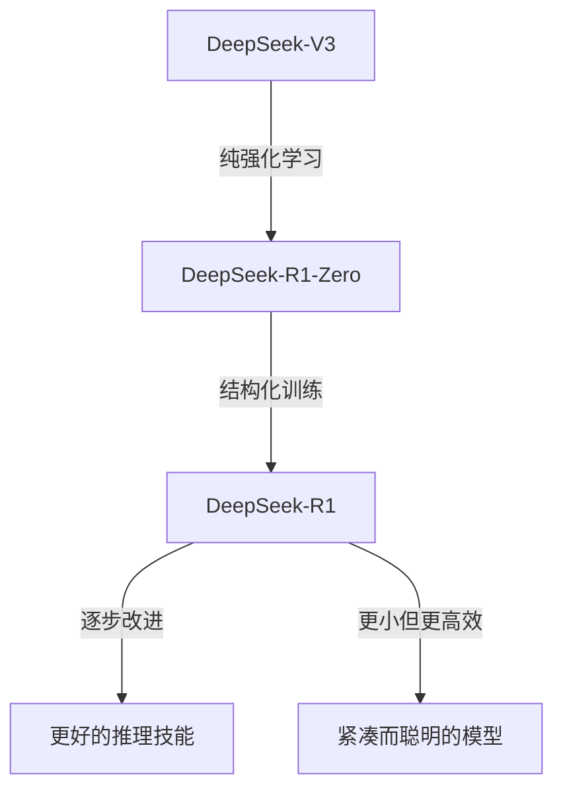

为了做到这一点，他们使用了强化学习，当 LLM 做出有利于推理的事情时，就奖励它，否则就惩罚它。

但这不仅仅是一个简单的训练环节。它就像一整套步骤，他们称之为“流水线”。他们首先尝试了纯强化学习，看看推理能力是否会自行涌现，这就是 DeepSeek-R1-Zero ，有点像个实验。然后，对于真正的 DeepSeek-R1 ，他们通过不同的阶段使微调过程更加的有序。也就是先给模型一些启动数据让它运行起来，然后进行强化学习，然后再输入更多数据，然后再输入更多强化学习......就像一步步升级一样！

关键在于让这些语言模型更好地思考问题并给出明智的答案，而不仅仅是简单的回应。

### 2. DeepSeek V3（MOE）如何思考？

```ad-note
MOE：混合专家模型
```

正如我之前所说，DeepSeek-R1 的训练并非从零开始构建，而是使用 DeepSeek-V3 作为基础模型。所以我们需要了解 V3 的工作原理以及它为什么被称为 MOE？

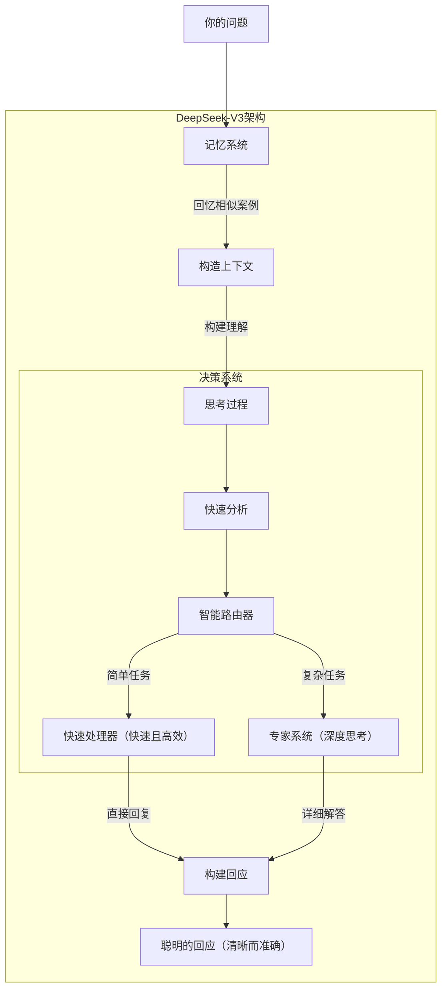

DeepSeek-V3 主要通过两条路径运行。当你输入一个问题时，它首先会经过一个记忆系统，该系统会通过查找相关信息来快速构建上下文。你可以把它想象成快速回忆你之前遇到过的类似情况。

它的主要优势在于其决策系统。在理解你的输入后，它会使用一个智能路由器在两条路径之间做出选择：快速处理器用于处理简单任务（例如简单问题或常见请求），专家系统用于处理复杂问题（例如分析或专业知识）。

```ad-note
这个路由器使 DeepSeek-V3 成为混合专家模型（MOE）
```

因为它动态地将每个请求路由到最合适的专家组件以进行有效处理。

简单的问题通过快速路径获得快速、直接的答案，而复杂的查询则通过专家系统得到详细的关注。最终，这些答案会被整合成清晰、准确的输出。

### 3. DeepSeek-V3 作为强化学习中的策略模型（Actor）

现在我们已经了解了 DeepSeek-V3 的思维方式，它是 DeepSeek-R1 实现的起点，我所说的起点是指它创建了 DeepSeek-R1-Zero 版本，这是在最终版本创建之前存在一些错误的初始版本。

初始版本 (R1-Zero) 是使用强化学习创建的，其中 DeepSeek-V3 充当强化学习智能体（采取动作的演员）。让我们先来直观地了解一下它的工作原理。

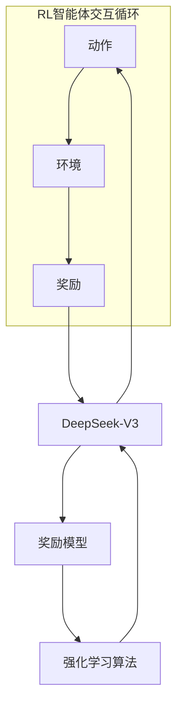

强化学习智能体（DeepSeek-V3）首先执行一个动作，这意味着它会针对给定的问题生成答案和一些推理，并将其放入其环境中。在这种情况下，环境就是推理任务本身。

执行动作后，环境会返回一个奖励（Reward）。这个奖励就像反馈一样，它告诉 DeepSeek-V3 基础模型动作的效果如何。正向奖励表示它做对了某件事，例如回答了正确的答案或推理过程很好。这个反馈信号随后会返回到 DeepSeek-V3 基础模型，帮助它学习并调整未来的采取动作的方式，以获得更好的奖励。

在接下来的部分中，我们将讨论这个带有奖励模型的强化学习算法，并尝试使用我们的文本输入来解决它。

### 4. GRPO 算法如何工作？

训练大模型的成本极其高昂，而强化学习则增加了更多的复杂性。

因此，虽然有很多可用的强化学习算法，但我们知道，传统的强化学习使用一种叫做“评论家”的模型来辅助主要的决策部分（也就是“演员”模型，例如 DeepSeek-V3）。这个评论家通常和演员本身一样庞大和复杂，这基本上会使计算成本翻倍。

然而，GRPO 的做法有所不同，因为它会根据一组动作的结果，直接计算出一个基线，即良好动作的参考点。因此，GRPO 根本不需要单独的评论家模型。这节省了大量计算量，提高了效率。

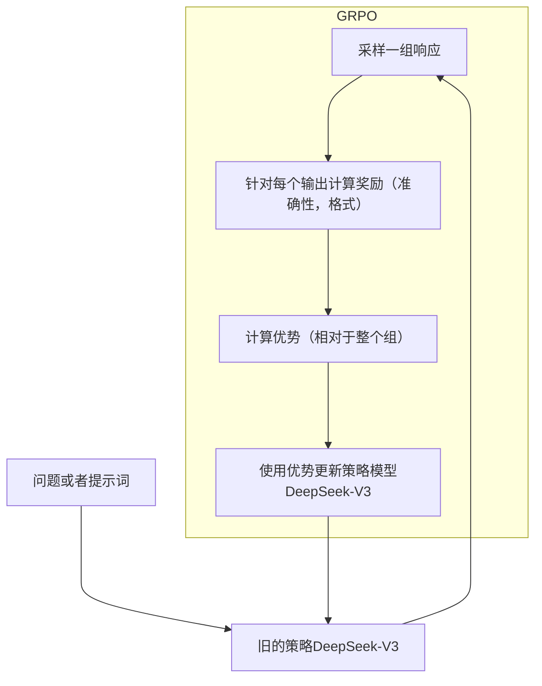

它首先向一个名为 “旧策略” 的模型提出一个问题或提示。GRPO 不会只生成一个答案，而是指示旧策略针对同一问题生成一组不同的答案。然后，对每个答案进行评估，并给出一个奖励分数，以反映其优劣程度或可取性。

GRPO 通过将每个答案与同一组内其他答案的平均质量进行比较，计算出其“优势”（Advantage）。高于平均水平的答案获得正优势，低于平均水平的答案获得负优势。至关重要的是，这一计算无需单独的评论家模型。

这些优势分数随后被用于更新旧策略，使其在未来更有可能产生优于平均水平的答案。更新后的模型将成为新的“旧策略”，并不断重复这个过程，不断迭代改进模型。

### 5. GRPO 的目标函数

显然，在这个 GRPO 背后，有复杂的数学。总之，我们可以称之为 GRPO 背后的目标函数。

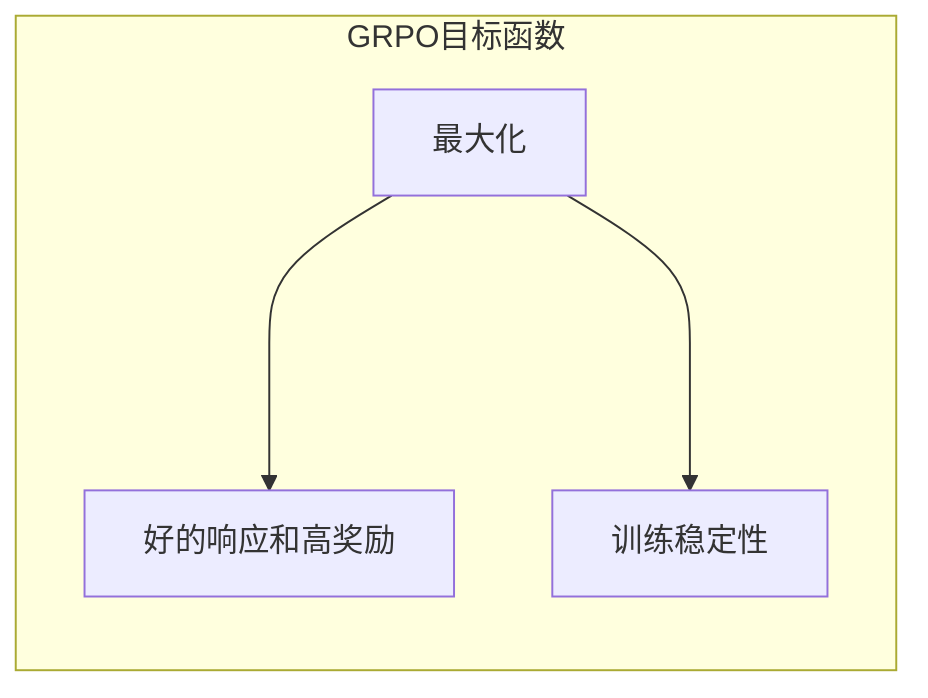

GRPO 的目标函数有两个目标：一是给出良好的输出（高奖励），同时确保训练过程稳定且不失控。原始函数有点吓人，但我们会在不影响其实际含义的情况下，将其改写成更简单的形式。

![[9.1.excalidraw|1000]]

让我们逐一分解。首先，平均结果 $\frac{1}{n}\sum_{i=1}^n(\cdots)$ 指的是评估在许多不同情况下平均发生的情况。我们提出一个包含各种问题的模型。对于每个问题，模型会生成一组答案。通过分析许多问题及其各自的答案组，我们可以计算出一个平均结果。

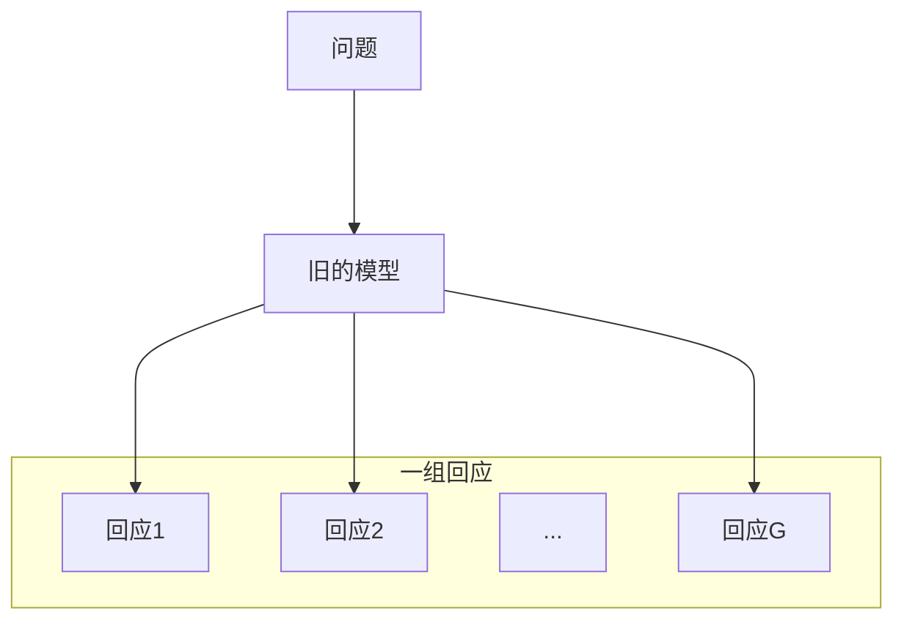

在此过程中，问题会被输入到一个旧模型中，该模型会产生多个答案（例如，答案 1、答案 2……答案 G）。这些答案组成一个组，通过对不同问题的评估，我们得出平均结果。

$\sum$ 是指对一组答案（例如，答案 1、答案 2、......、答案 G）中的每个答案进行计算，然后将所有这些计算的结果相加。

接下来是奖励部分。这部分用于奖励给出良好答案的模型。它内部有点复杂，我们来看一下：

![[9.2.excalidraw|1000]]

==变化率== 告诉我们，新模型下，给出这个答案的概率是增加了还是减少了。具体来说，它关注的是：

- 新模型给出某个回答的概率。
- 旧模型给出相同回答的概率。

接下来，优势分数表明一个答案与同一组中的其他答案相比，优劣程度如何。其计算方法如下：

$$
\frac{\text{答案分数}-\text{组内平均分数}}{\text{组内分数分布}} \rightarrow \text{答案的分数好多少}
$$

- 答案分数 ：给予特定答案的奖励。
- 组内平均分数 ：群组内所有答案的平均奖励分数。
- 组内分数分布 ：组中答案分数的差异有多大。

优势分数告诉我们一个答案是否比小组内的平均水平更好，以及好多少。

将 `变化率` 限制在 $(1-\epsilon,1+\epsilon)$ 范围内。

`截断的变化率` 是 `变化率` 的修改版本。 它确保 `变化率` 不会波动过大，从而保持模型的学习稳定性。该限制由 $\epsilon$ 这个很小的值决定，以确保变化不会过于剧烈。

最后，`min` 函数在两个选项中选取较小的值：

- `变化率 × 优势` ：答案可能性的变化乘以其优势得分。
- `截断的变化率 × 优势` ：相同，但变化率有限。

通过选择较小的值，模型可以确保学习过程保持平稳，并且不会对性能的大幅变化反应过度。最终的结果是“良好答案奖励”，鼓励模型改进，但不会过度补偿。

最后，我们减去 `保持稳定部分` 。这是为了让新模型与旧模型之间不会出现太大的变化。这并不复杂，但让我们放大来看：

$$
\text{保持稳定部分} = \beta \times \text{和参考模型的差异} \rightarrow \text{“尽量靠近旧的模型”}
$$

`和参考模型的差异` 衡量的是新模型与参考模型（通常是旧模型）的差异程度。本质上，它有助于评估新模型与旧模型相比所做的更改。

$\beta$ 值控制着模型与参考模型的接近程度。$\beta$ 值越大，模型将优先接近旧模型的行为和输出，从而防止出现过大的偏差。让我们直观地看一下：

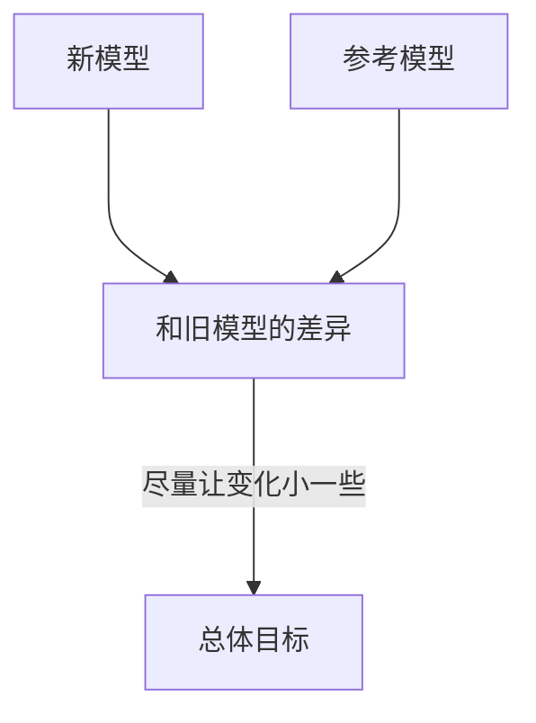

简而言之， `保持稳定部分` 确保模型逐步学习并且不会出现疯狂的跳跃。

```ad-note
我们在学习 TRPO 和 PPO 时，其实做的事情就是不想让策略模型变化太过剧烈。
```

### 6. DeepSeek R1 Zero 的奖励建模

现在我们已经了解了主要的理论概念，让我们使用文本输入来了解创建 R1 Zero 的奖励模型是如何运作的。

记住，在 R1 Zero 中，他们把事情做得简单直接。他们没有使用复杂的神经网络来判断答案（就像在后期阶段那样），而是使用了基于规则的奖励系统 。

对于我们的数学问题： “2 + 3 * 4 等于多少？”

#### 基于规则的检查

系统知道正确答案是14。它将查看 DeepSeek V3（我们的强化学习智能体）生成的输出，并专门检查 `<answer>` 标签内部。

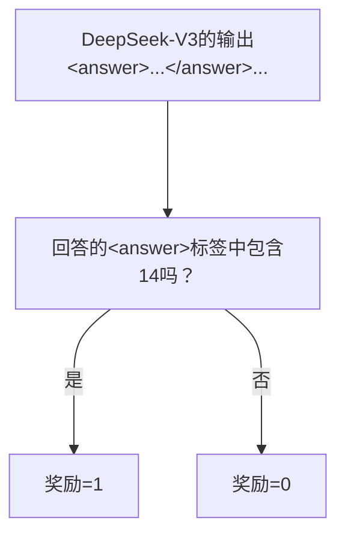

如果 `<answer>` 标签包含“14”（或数值相同的数字），它会获得正奖励，比如说 `+1` 。如果答案错误，它会获得 `0` 奖励，甚至可能是负奖励（不过本文现阶段为了简单起见主要关注 0 奖励）。

#### Format Rewards  格式奖励

但是 DeepSeek R1 Zero 还需要学习正确地构建其推理，并且为了能够使用 `<think>` 和 `<answer>` 标签，正确使用格式的奖励较小。

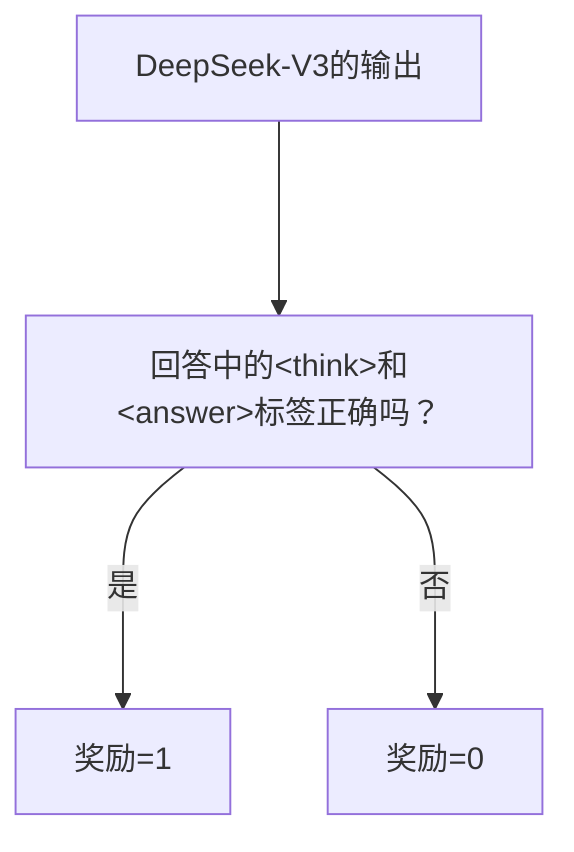

检查模型输出是否正确包含 `<think>...</think>` 内的推理过程以及 `<answer>...</answer>` 内的最终答案。

> [!NOTE]
> DeepSeek R1 论文明确提到避免使用 DeepSeek-R1-Zero 的奖励模型，以防止奖励黑客攻击并降低初始探索阶段的复杂性

### 7. 奖励训练模板

为了使奖励模型有效，研究人员设计了一个特定的训练模板。该模板充当蓝图，指导 DeepSeek-V3 基础模型在强化学习过程中如何构建其响应。

让我们看一下原始模板并将其逐一分解：

```
A conversation between User and Assistant. The user asks a question, and 
the Assistant solves it. The assistant first thinks about the reasoning 
process in the mind and then provides the user with the answer. The reasoning 
process and answer are enclosed within <think> </think> and <answer> </answer>
tags respectively, i.e., <think> reasoning process here </think>
<answer> answer here </answer>. User: {prompt}. Assistant:
```

我们在 `{prompt}` 中输入数学问题，例如 `2 + 3 * 4` 等于多少？ 最重要的是 `<think>` 和 `<answer>` 标签。这种结构化的输出对于研究人员日后深入了解模型的推理步骤至关重要。

在训练 DeepSeek-R1-Zero 时，我们使用此模板为其提供提示。对于我们的示例问题，输入如下：

```
A conversation between User and Assistant. The user asks a question, and 
the Assistant solves it. The assistant first thinks about the reasoning 
process in the mind and then provides the user with the answer. The reasoning 
process and answer are enclosed within <think> </think> and <answer> </answer>
tags respectively, i.e., <think> reasoning process here </think>
<answer> answer here </answer>. User: What is 2 + 3 * 4?. Assistant:
```

并且我们期望模型生成符合模板的输出，例如：

```
<think>
Order of operations:
multiply before add. 3 * 4 = 12. 2 + 12 = 14
</think>
<answer>
14
</answer>
```

> [!NOTE]
> 有趣的是，DeepSeek 团队有意让这个模板保持简单并专注于结构，而不是告诉模型如何推理。

### 8. DeepSeek R1 Zero 的强化学习训练过程

虽然论文没有指定强化学习预训练的确切初始数据集，但我们假设它应该以推理为中心。

他们做的第一步是使用旧策略（强化学习更新之前的 DeepSeek-V3 基础模型）生成多个可能的输出。在一次训练迭代中，我们假设 GRPO 采样一组 `G = 4` 个输出。

例如，模型针对我们的文本输入生成以下四个输出 ：`2 + 3 * 4 等于多少？`

- o1: `<think> 2 + 3 = 5, 5 * 4 = 20 </think> <answer> 20 </answer>` （运算顺序不正确）
- o2: `<think> 3 * 4 = 12, 2 + 12 = 14 </think> <answer> 14 </answer>` （正确）
- o3: `<answer> 14 </answer>` （正确，但缺少 `<think>` 标签）
- o4: `<think> ...some gibberish reasoning... </think> <answer> 7 </answer>` （不正确且推理不充分）

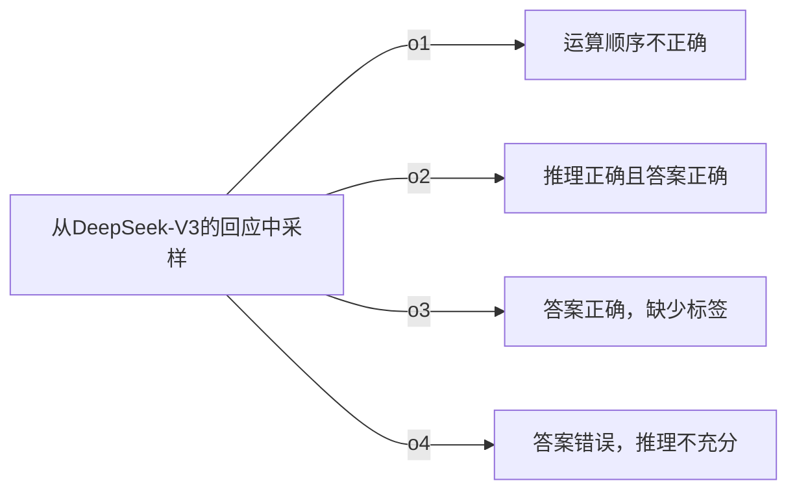

每个输出将根据正确性和推理质量进行评估并分配奖励。

为了引导模型更好地推理， **基于规则的奖励系统** 应运而生。每个输出都会根据以下条件分配奖励：

- **准确率奖励** ： 答案是否正确。
- **格式奖励** ： 推理步骤是否使用 `<think>` 标签正确格式化。

假设奖励分配如下：

| 输出  | 准确性奖励     | 格式奖励 | 总奖励 |     |
| --- | --------- | ---- | --- | --- |
| o1  | 推理错误      | 0    | 0.1 | 0.1 |
| o2  | 推理正确      | 1    | 0.1 | 1.1 |
| o3  | 答案正确，缺少标签 | 1    | 0   | 1.0 |
| o4  | 答案错误，推理拉胯 | 0    | 0.1 | 0.1 |

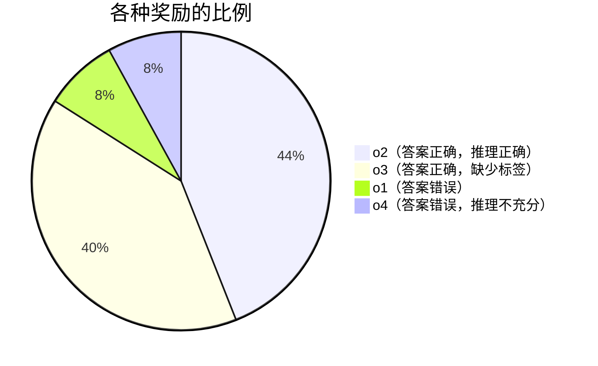

该模型应该学会 **青睐具有更高奖励的输出** ，同时降低产生不正确或不完整输出的概率。

为了确定每个输出对模型性能的提升或下降程度，我们使用奖励值计算 **优势** 。优势有助于通过强化更好的输出来优化策略。

为此，让我们计算平均首次奖励。

$$
\text{平均奖励} = \frac{0.1+1.1+1+0.1}{4} = 0.575
$$

标准差（近似值）= 0.5， 现在计算每个输出的优势。

$$
A_i = \frac{r_i-\text{平均奖励}}{标准差}
$$

其中 $r_i$ 是第 $i$ 次输出的奖励。

$$
\begin{split}
A_1 &= \frac{0.1-0.575}{0.5} \approx -0.95 \\
A_2 &= \frac{1.1-0.575}{0.5} \approx 1.05  \\
A_3 &= \frac{1.0-0.575}{0.5} \approx 0.85  \\
A_4 &= \frac{0.1-0.575}{0.5} \approx -0.95 \\
\end{split}
$$

计算每个输出的奖励

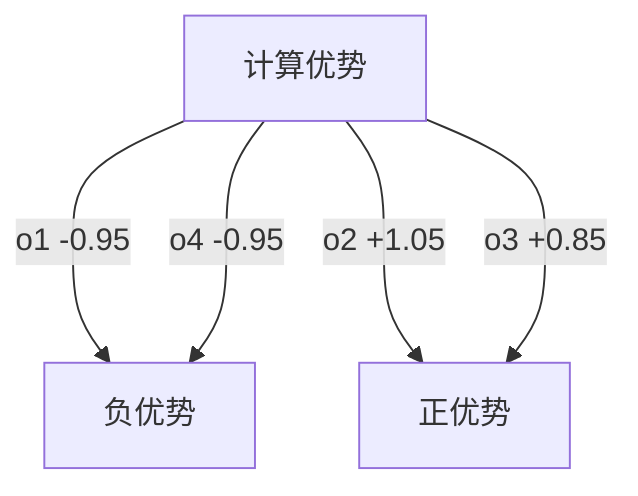

可视化优势计算

输出 o2 和 o3 获得正优势 ，这意味着它们应该受到鼓励。输出 o1 和 o4 获得负优势 ，这意味着它们应该受到阻止。

然后，GRPO 使用计算出的优势来更新策略模型（DeepSeek-V3），以增加生成具有高优势的输出（如 o2 和 o3）的概率，并降低具有低优势或负优势的输出（如 o1 和 o4）的概率。

更新根据以下内容调整模型权重：

- 策略比率： 新策略与旧策略下产生某个回答的概率。
- 裁剪机制： 防止过大的更新导致训练不稳定。
- KL散度惩罚： 确保更新不会偏离原始模型太远。

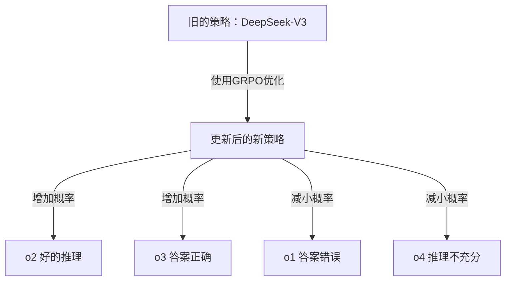

这确保了在下一次迭代中，模型更有可能生成正确的推理步骤，同时减少不正确或不完整的响应。

因此，强化学习是一个迭代过程。上述步骤使用不同的推理问题重复数千次。每次迭代都会逐渐提升模型的以下能力：

- 执行正确的操作顺序
- 提供逻辑推理步骤
- 始终使用正确的格式

整个训练循环如下所示：

![[9.3.excalidraw|1000]]

随着时间的推移，模型会从错误中学习，从而变得更加准确和有效地解决推理问题。

### 9. R1-Zero 的两个主要问题

在 V3 模型上使用强化学习训练流程创建 DeepSeek-R1-Zero 后，研究人员发现训练后的模型在推理测试中表现非常出色，甚至在 AIME 2024 等任务上的得分与 OpenAI-01-0912 等更高级的模型相当。这表明，使用强化学习来增强语言模型的推理能力是一种很有前景的方法。

但他们也注意到 DeepSeek-R1-Zero 存在一些关键问题，需要修复才能用于实际应用和更广泛的研究。

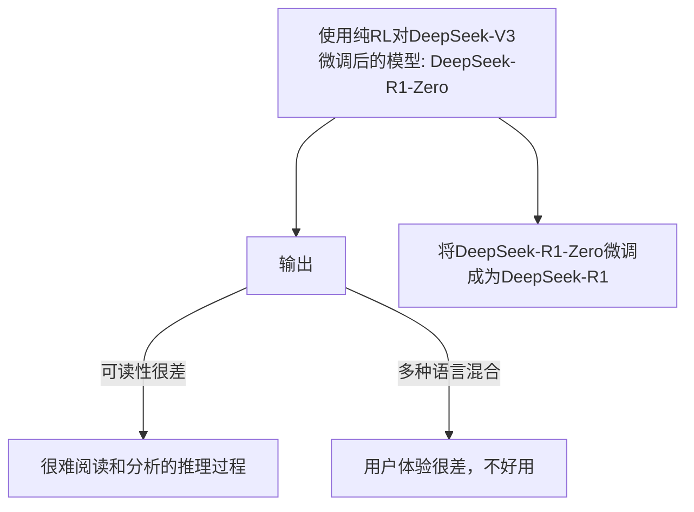

DeepSeek 的研究人员表示，该模板刻意设计得简单且注重结构。它避免对推理过程本身施加任何特定于内容的限制。例如，它不会说：

- “你必须使用逐步推理”（它只是说“推理过程”，而模型则负责定义其含义）。
- “你必须运用反思性推理”
- “你必须使用特定的问题解决策略”

主要问题在于 `<think>` 标签内的推理过程难以阅读，这使得人类难以理解和分析。

另一个问题是语言混合。当被问及多语言问题时，模型有时会在同一个答案中混合使用多种语言，导致输出不一致且令人困惑。比如说，如果你用西班牙语问它问题，它的“思维”就会突然变成英语和西班牙语的混杂，显得不够清晰！这些问题，混乱的推理和语言混淆，显然是障碍。

> [!NOTE]
> 这是他们将最初的 R1 Zero 模型改造为 R1 的两个主要原因

在下一节中，我们将介绍他们如何将 R1 Zero 模型改进为 R1 模型，从而提高其性能并帮助其超越所有其他模型（无论是开源的还是闭源的）。

### 10. 冷启动数据

因此，为了解决 R1-Zero 的问题并真正获得正确的推理，研究人员进行了冷启动数据收集以及监督微调（SFT）。

你可以把它想象成在真正高强度的强化学习训练之前，为模型打下良好的推理基础。本质上，他们想教会 DeepSeek-V3 良好的推理是什么样子，以及如何清晰地呈现它。

### 11. Few Shot提示与长思维链

他们为 DeepSeek-V3 提供了一些问题示例，并提供了非常详细的分步解决方案，称为“思维链”（CoT）。其目的是让模型通过示例学习，并开始模仿这种循序渐进的推理方式。

让我们直观地理解这个基于示例的学习：

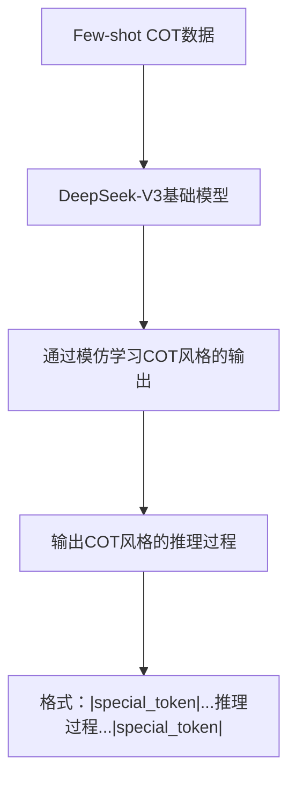

对于我们的示例问题 `2 + 3 * 4 等于多少？` ，他们可能会显示如下提示：

```
Problem Examples with Solutions:

Problem: What's the square root of 9 plus 5?
Solution: |special_token| First, find the square root of 9, which is 3. 
Then, add 5 to 3.  3 + 5 equals 8. |special_token| Summary: The answer is 8.

Problem: Train travels at 60 mph for 2 hours, how far?
Solution: |special_token| Use the formula: Distance = Speed times Time. 
Speed is 60 mph, Time is 2 hours. Distance = 60 * 2 = 120 miles. 
|special_token| Summary: Train travels 120 miles.

Problem: What is 2 + 3 * 4?
Solution:
```

那些 `|special_token|` 东西只是将推理步骤与摘要分开的token，使模型能够清楚地学习回答的结构。

看到这些例子后，模型应该学会以类似的格式给出答案，比如 `2 + 3 * 4` 等于多少？

```
|special_token|  Following order of operations (PEMDAS/BODMAS), 
do multiplication before addition.  So, first calculate 3 * 4 = 12. 
Then, add 2 to 12. 2 + 12 = 14. |special_token| Summary: The answer is 14.
```

### 12. 直接给出提示

他们收集数据的另一种方式是直接提示模型不仅要解决问题，而且还逐步明确地展示其推理，然后仔细检查其答案。


这是为了促进更仔细、更周到地解决问题。

对于 `2 + 3 * 4` 等于多少？ 提示可能是：

```
Problem: Solve this, show reasoning step-by-step, and verify:
What is 2 + 3 * 4?
```

他们确实期望输出包含推理步骤和验证部分：

```
| special_token | Reasoning: To solve 2 + 3 * 4, I need to use order of 
operations. Multiplication comes before addition.
Step 1: Calculate 3 * 4 = 12.
Step 2: Add 2 to the result from step 1: 2 + 12 = 14.
Verification:  Checking order of operations again, yes, multiplication 
is before addition.  Calculation looks right.
| special_token | Summary: The answer is 14.
```

### 13. 后训练步骤

他们甚至使用了已经训练好的 R1 Zero 模型的输出。尽管 R1 Zero 存在一些问题，但它可以进行一些推理。因此，他们采用了 R1 Zero 的输出，并请人工注释，使其更加清晰、结构化，并纠正任何错误。

例如，混乱的 R1 Zero 输出可能是：

```
<think>  ummm... multiply 3 and 4... get 12... then add 2...</think>
<answer> 14 </answer>
```

然后，人类会对其进行改进，使其更加清晰、格式更好：

```
|special_token| Reasoning: To solve this, we use order of operations,
doing multiplication before addition.
Step 1: Multiply 3 by 4, which is 12.
Step 2: Add 2 to the result: 2 + 12 = 14.
|special_token| Summary: The answer is 14.
```

可视化细化过程如下：

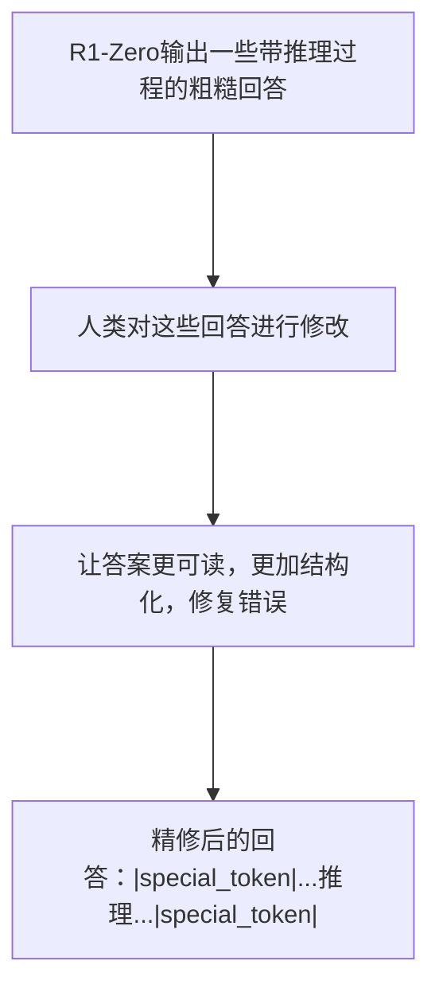

他们最终获得的冷启动数据非常好，因为：

- 高质量推理示例： 每个示例都展示了良好的、循序渐进的推理。
- 一致、可读的格式： `|special_token|` 格式使一切统一且易于处理。
- 人工检查： 他们确保过滤掉任何不好的例子，因此数据干净可靠。

获得冷启动数据后，他们进行了监督微调（SFT） 。

### 13. 监督微调

SFT 第一阶段的核心思想是利用监督学习来教 DeepSeek-V3 如何产生高质量、结构化的推理输出。

基本上，我们向模型展示许多良好推理的例子，并要求它学习模仿这种风格。

对于 SFT，我们需要将冷启动数据格式化为 `输入-目标` 对 。对于数据集中的每个推理问题，我们都会创建如下一对：

`输入 =` 提示或问题描述本身

```
User: What is 2 + 3 * 4? Assistant:
```

这就是我们输入模型的内容，我们的目标是相应的结构良好的推理和答案

```
|special_token| According to the order of operations (PEMDAS/BODMAS) ... 
Summary: The answer is 14.
```

这是我们希望模型学习生成的理想输出。

我们告诉模型：

> 当你看到这个输入（问题）时，我们希望你产生这个目标输出（好的推理和答案）

我们先用可视化的方式解释一下，这样更容易理解 SFT 的含义，而不是用详细的文字解释，这样你很难理解。

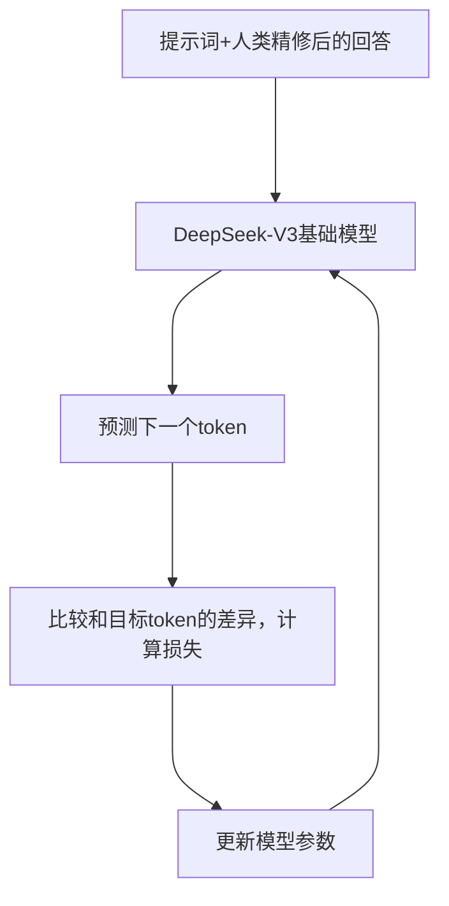

微调过程从 “输入：提示 + 目标推理” 开始，我们提供一个问题和一个结构化的推理示例。这将训练模型（ DeepSeek-V3 模型） 生成结构良好的响应。

在 “预测下一个token” 中，模型会生成推理序列中的下一个token。在 “与目标token比较（计算损失）” 中，模型会使用损失函数将其与实际的下一个token进行比较。损失越大，表示预测结果与正确 token 的距离越远。

在“更新模型参数”过程中，反向传播和优化器会调整模型的权重，以改进其预测效果。此过程循环往复，在多个`输入-目标`对上重复进行，每次迭代都会逐步提升模型的结构化推理能力。

### 14. 面向推理的强化学习

他们为 DeepSeek V3 提供了 SFT 推理教育，但为了真正提高其推理能力，研究人员引入了面向推理的学习！

在这里，我们采用 SFT 精细微调过的 DeepSeek-V3 模型，并通过强化学习推动它变得更好。

他们确实使用了相同的 GRPO 算法，但此阶段真正的升级是奖励系统。他们添加了新的、非常重要的“语言一致性奖励”！

还记得 R1 Zero 有时会混淆不同语言吗？为了解决这个问题，他们专门增加了对保持语言一致性的奖励。这个想法很简单，如果你用英语提问，我们希望推理和答案也用英语。

让我们直观地看一下语言一致性奖励的计算：

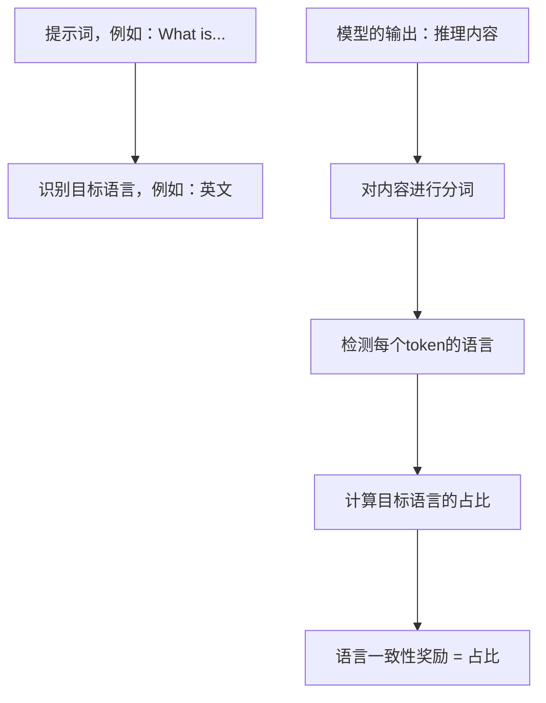

为了理解上图，我们回顾一下之前的示例输出 o1 和 o2 ，并观察新的语言一致性奖励机制对奖励的影响。为简单起见，我们假设目标语言为英语。

让我们看看这些奖励如何与示例输出产生作用。考虑第一个输出 o1，它错误地计算了“2 + 3 * 4”，但却用英语表达了其错误的推理：

```
<think> 2 + 3 = 5, 5 * 4 = 20 </think> <answer> 20 </answer>
```

由于答案错误，准确率奖励自然为 0。然而，由于推理过程被假设 100% 使用目标语言（本例中为英语），因此语言一致性奖励为 `1` 。

在计算强化学习阶段的总奖励时，我们会将这些权重结合起来。如果我们将准确率奖励的权重设为 `1` ，将语言一致性奖励的权重设为较小的 `0.2` ，则 o1 的总奖励为：

```
Total Reward = (1 * Accuracy Reward) + (0.2 * Language Consistency Reward)

(1 * 0) + (0.2 * 1) = 0.2
```

现在考虑输出 o2，它正确解决了问题并且用英语进行了推理：

```
<think> 3 * 4 = 12, 2 + 12 = 14 </think> <answer> 14 </answer>
```

此输出因正确答案而获得完美准确率奖励 `1` 。假设其推理也完全基于英语，则其语言一致性奖励也为 `1` 。使用与之前相同的权重，o2 的总奖励为

```
(1 * 1) + (0.2 * 1) = 1.2
```

请注意，只要保持语言一致性，语言一致性奖励即使对于正确答案也会略微提高总奖励，甚至对于错误答案 o1 也会提供小幅正奖励。

这个强化学习训练循环遵循我们之前看到的相同的 DeepSeek R1 Zero 训练循环：

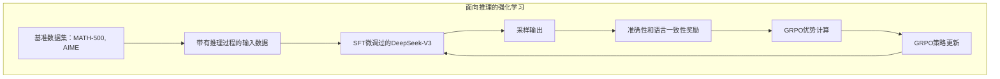

1. 生成多个输出。
2. 完善奖励，包括语言一致性。
3. 使用 GRPO 进行优势估计。
4. 训练模型以支持高优势输出。
5. goto 1。

### 15. 拒绝采样

对于推理数据，DeepSeek 团队希望获取绝对最佳的样本来进一步训练模型。为此，他们使用了一种名为“拒绝采样”的技术。

```mermaid
graph TB
    A["DeepSeekp-R1第一阶段训练的检查点"] ---> B["针对每个问题输出多个回答，例如16个回答"] ---> C["评估每个回答的正确性和可读性"]
    C -- 好的回答 ---> D["保留最好的回答，也就是拒绝采样"] ---> E["高质量推理数据"]
    C -- 不好的回答 ---> F["直接拒绝"]
```

为了改进推理数据，DeepSeek 使用了拒绝采样（Rejection Sampling）算法。对于“2 + 3 * 4 等于多少？”这个问题，他们会从上一阶段的模型中生成许多输出。想象一下，如果输出结果像 `<answer>20</answer>` （错误）和 `<answer>14</answer> <think>…</think>` （正确，推理正确）那样会是什么样。

然后，他们会评估每个输出的正确性（答案“14”）和推理的可读性。只有最正确、推理充分的输出才会被保留，其他输出则会被拒绝。

对于复杂的推理，“生成式奖励模型”用于判断推理质量。严格的过滤器会去除混合语言、冗长的推理或不相关的代码。此过程可生成约 60 万个高质量的推理样本。

除了改进的推理数据外，他们还添加了用于一般技能的非推理数据（约 20 万个样本）：写作、质量保证、翻译等，有时还会使用思维链来完成复杂的任务。

最后， SFT 第 2 阶段使用下一个token预测，在组合数据集（改进的推理 + 非推理数据）上训练之前的模型检查点。此阶段使用来自拒绝采样的顶级示例进一步改进推理，并将模型推广到更广泛的任务，同时保持用户友好性。

“2 + 3 * 4 等于多少？” 现在，一个完美提炼的推理示例成为了该训练数据的一部分。

```ad-note
这就是 **拒绝采样** ，我们拒绝低于标准的样本，只保留最好的样本，以生成高质量的训练数据。
```

### 16. 适用于所有场景的强化学习

在 SFT 第二阶段之后，我们已经实现了 DeepSeek-V3 的推理能力、持续的语音识别能力，甚至能够出色地处理一般任务！但为了真正使其成为顶级的 AI 助手，我们进行了最后的研究，使其与人类价值观相符。这就是全场景强化学习（强化学习第二阶段）的使命！这可以说是 DeepSeek-R1 真正安全的最终润色。

```mermaid
graph TD
    A["DeepSeekp-R1第二阶段训练的检查点的输入提示词"] ---> B["任务类型？"] -- 普通任务 ---> C["神经奖励模型"]
    B -- 推理任务 ---> G["基于规则的奖励函数"]
    C ---> D["回答的有用性的评价模型，检查回答的摘要"]
    C ---> F["回答的有害性的评价模型，检查整个回答"]
    D ---> H["加权计算后的总奖励"]
    F ---> H
    G ---> H
```

对于我们的例子“2 + 3 * 4 等于多少？”，虽然准确性奖励仍然强化正确答案，但奖励系统现在还会考虑：

1. 有用性，评估摘要（如果生成）是否提供了除答案之外的有用背景信息。
2. 无害性，检查整个输出内容是否安全且无偏见。这些通常由根据人类偏好训练的单独奖励模型进行评估。

最终的奖励信号成为准确性、有用性和无害性分数的加权组合 。

现在，训练数据包括

- 多样化组合，包括推理问题
- 常规 QA 提示
- 写作任务
- 以及偏好对，其中人类指出两个模型输出中哪一个在有用性和无害性方面更好。

训练过程遵循迭代强化学习循环（可能使用 GRPO）来根据来自这些多样化数据的组合奖励信号来优化模型。

经过多次迭代训练，该模型不断完善，在推理性能和对齐（有用性/无害性）之间取得良好的平衡。一旦达到这一平衡，该模型将在热门基准数据集上进行评估，并超越其他模型的表现。

> 他们的最终检查点，高度优化的版本被命名为 DeepSeek-R1

### 17. 蒸馏

```mermaid
graph TB
    A["准备数据"] ---> B["800k条推理数据"] ---> C["DeepSeek-R1的输出"] ---> D["对学生模型进行SFT"] ---> E["学生模型：Qwen-1.5B等"] ---> F["蒸馏出来的模型Qwen-1.5B等"]
    F ---> G["更小的，速度更快的，有推理能力的小模型"]
```

在 DeepSeek 团队能够创建性能良好的 DeepSeek R1 之后，他们进一步将较大的模型提炼成性能更高的小型模型，供社区使用。提炼过程如下：

- 数据准备：收集 800k 个推理样本。
- DeepSeek-R1 输出：对于每个样本，来自教师模型（DeepSeek-R1）的输出被用作学生模型的目标。
- 监督微调（SFT）：学生模型（例如，Qwen-1.5B，Llama-14B）在这些 800k 个样本上进行微调，以匹配 DeepSeek-R1 输出。
- 提炼模型：学生模型现在被提炼为更小的版本，但保留了 DeepSeek-R1 的大部分推理能力。
- 结果：我们获得了更小、更快、具有良好推理能力的模型，可供部署。

## 2. 动手实现 GRPO

![[9.4.excalidraw|1000]]

创建文件夹：`GRPO-ZERO` 。

### 1. 选择底座模型

我们使用 `Qwen2.5-3B-Instruct` 。因为更大的模型，会消耗更多的算力。这里我们选择 `3B` 尺寸的模型来微调产生思维链，就需要 48G 的显存资源（英伟达L20显卡）。

先看一下项目的配置文件 `GRPO-ZERO/config.yaml` 。

```yaml
model:
  pretrained_model_path: "Qwen2.5-3B-Instruct"
  device: "cuda"
  dtype: "bfloat16"
data:
  path: "Countdown-Tasks-3to4"
  test_size: 128
training:
  random_seed: 1337
  max_prompt_len: 256
  max_gen_len: 1024
  batch_size: 256
  num_questions_per_batch: 32
  # Number of examples per gradient accumulation step
  micro_batch_size: 2
  max_grad_norm: 1.0
  learning_rate: 1.0e-5
  weight_decay: 0.0
  betas: [0.9, 0.999]
  ckpt_dir: "ckpt"
  log_dir: "logs"
  skip_unfinished_episodes: false
  ckpt_save_interval: 100
  eval_interval: 10
  memory_efficient_adamw: false
```

为了不依赖 `transformers` 库。我们把 Qwen2.5 的模型给抠出来。放在文件 `GRPO-ZERO/qwen2_model.py` 中。

如下所示

```python
import json
from dataclasses import dataclass
from pathlib import Path
from typing import Optional, Tuple, Union

import torch
import torch.nn.functional as F
from torch import nn


@dataclass
class Qwen2Config:
    attention_dropout: float = 0.0
    bos_token_id: int = 151643
    eos_token_id: int = 151645
    hidden_act: str = "silu"
    hidden_size: int = 2048
    initializer_range: float = 0.02
    intermediate_size: int = 11008
    max_position_embeddings: int = 32768
    max_window_layers: int = 70
    model_type: str = "qwen2"
    num_attention_heads: int = 16
    num_hidden_layers: int = 36
    num_key_value_heads: int = 2
    rms_norm_eps: float = 1e-06
    rope_theta: float = 1000000.0
    sliding_window: int = 32768
    tie_word_embeddings: bool = True
    torch_dtype: str = "bfloat16"
    use_cache: bool = True
    use_sliding_window: bool = False
    vocab_size: int = 151936


class RMSNorm(torch.nn.Module):
    def __init__(self, dim: int, eps: float = 1e-6):
        super().__init__()
        self.eps = eps
        self.weight = nn.Parameter(torch.ones(dim))

    def _norm(self, x):
        return x * torch.rsqrt(x.pow(2).mean(-1, keepdim=True) + self.eps)

    def forward(self, x):
        input_dtype = x.dtype
        x = x.to(torch.float32)
        x = self._norm(x).type_as(x)
        x = self.weight * x.to(input_dtype)
        return x


def rotate_half(x):
    """Rotates half the hidden dims of the input."""
    x1 = x[..., : x.shape[-1] // 2]
    x2 = x[..., x.shape[-1] // 2 :]
    return torch.cat((-x2, x1), dim=-1)


def apply_rotary_pos_emb(q, k, cos, sin, unsqueeze_dim=2):
    cos = cos.unsqueeze(unsqueeze_dim)
    sin = sin.unsqueeze(unsqueeze_dim)
    q_embed = (q * cos) + (rotate_half(q) * sin)
    k_embed = (k * cos) + (rotate_half(k) * sin)
    return q_embed, k_embed


class Attention(nn.Module):
    def __init__(self, args: Qwen2Config):
        super().__init__()
        self.n_kv_heads = (
            args.num_attention_heads
            if args.num_key_value_heads is None
            else args.num_key_value_heads
        )
        self.n_heads = args.num_attention_heads
        self.n_kv_heads = self.n_kv_heads
        self.n_rep = self.n_heads // self.n_kv_heads
        self.head_dim = args.hidden_size // args.num_attention_heads

        self.q_proj = nn.Linear(
            args.hidden_size,
            args.num_attention_heads * self.head_dim,
            bias=True,
        )
        self.k_proj = nn.Linear(
            args.hidden_size,
            args.num_key_value_heads * self.head_dim,
            bias=True,
        )
        self.v_proj = nn.Linear(
            args.hidden_size,
            args.num_key_value_heads * self.head_dim,
            bias=True,
        )
        self.o_proj = nn.Linear(
            args.num_attention_heads * self.head_dim,
            args.hidden_size,
            bias=False,
        )
        self.args = args

    def init_kv_cache(
        self,
        max_batch_size: int,
        max_seq_len: int,
        dtype: torch.dtype,
        device: torch.device,
    ):
        cache_shape = (max_batch_size, max_seq_len, self.n_kv_heads, self.head_dim)
        cache_k = torch.zeros(cache_shape, dtype=dtype, device=device)
        cache_v = torch.zeros(cache_shape, dtype=dtype, device=device)
        self.register_buffer("cache_k", cache_k, persistent=False)
        self.register_buffer("cache_v", cache_v, persistent=False)

    def del_kv_cache(self):
        self.cache_k = None
        self.cache_v = None

    def forward(
        self,
        x: torch.Tensor,
        pos_embed: Tuple[torch.Tensor, torch.Tensor],
        start_pos: Optional[Union[int, torch.Tensor]] = None,
    ):
        bsz, seqlen, _ = x.shape
        xq, xk, xv = self.q_proj(x), self.k_proj(x), self.v_proj(x)
        xq = xq.view(bsz, seqlen, self.n_heads, self.head_dim)
        xk = xk.view(bsz, seqlen, self.n_kv_heads, self.head_dim)
        xv = xv.view(bsz, seqlen, self.n_kv_heads, self.head_dim)

        cos, sin = pos_embed
        xq, xk = apply_rotary_pos_emb(xq, xk, cos, sin, unsqueeze_dim=2)
        if start_pos is not None:
            # inference mode
            end_pos = start_pos + seqlen
            self.cache_k[:bsz, start_pos:end_pos, :, :] = xk
            self.cache_v[:bsz, start_pos:end_pos, :, :] = xv
            output = torch.nn.functional.scaled_dot_product_attention(
                query=xq.transpose(1, 2),
                key=self.cache_k[:bsz, :end_pos].transpose(1, 2),
                value=self.cache_v[:bsz, :end_pos].transpose(1, 2),
                is_causal=True if seqlen > 1 else False,
                enable_gqa=True,
            ).transpose(1, 2)
        else:
            # training mode
            output = torch.nn.functional.scaled_dot_product_attention(
                query=xq.transpose(1, 2),
                key=xk.transpose(1, 2),
                value=xv.transpose(1, 2),
                is_causal=True,
                enable_gqa=True,
            ).transpose(1, 2)
        output = output.reshape(bsz, seqlen, -1)
        return self.o_proj(output)


class FeedForward(nn.Module):
    def __init__(
        self,
        dim: int,
        intermediate_size: int,
    ):
        super().__init__()
        self.up_proj = nn.Linear(dim, intermediate_size, bias=False)
        self.down_proj = nn.Linear(intermediate_size, dim, bias=False)
        self.gate_proj = nn.Linear(dim, intermediate_size, bias=False)

    def forward(self, x):
        x = self.down_proj(F.silu(self.gate_proj(x)) * self.up_proj(x))
        return x


class TransformerBlock(nn.Module):
    def __init__(self, layer_id: int, args: Qwen2Config):
        super().__init__()
        self.n_heads = args.num_attention_heads
        self.dim = args.hidden_size
        self.head_dim = args.hidden_size // args.num_attention_heads
        self.self_attn = Attention(args)
        self.mlp = FeedForward(
            dim=args.hidden_size,
            intermediate_size=args.intermediate_size,
        )
        self.layer_id = layer_id
        self.input_layernorm = RMSNorm(args.hidden_size, eps=args.rms_norm_eps)
        self.post_attention_layernorm = RMSNorm(args.hidden_size, eps=args.rms_norm_eps)

    def forward(
        self,
        x: torch.Tensor,
        pos_embed: Tuple[torch.Tensor, torch.Tensor],
        start_pos: Optional[Union[int, torch.Tensor]] = None,
    ):
        h = x + self.self_attn(self.input_layernorm(x), pos_embed, start_pos=start_pos)
        out = h + self.mlp(self.post_attention_layernorm(h))
        return out


class Qwen2RotaryEmbedding(nn.Module):
    def __init__(self, config: Qwen2Config, device: torch.device):
        super().__init__()
        self.config = config
        base = config.rope_theta
        dim = config.hidden_size // config.num_attention_heads
        with torch.autocast(device_type=device.type, dtype=torch.float32):
            inv_freq = 1.0 / (
                base
                ** (torch.arange(0, dim, 2, dtype=torch.int64).float().to(device) / dim)
            )
        self.register_buffer("inv_freq", inv_freq, persistent=False)

    @torch.no_grad()
    def forward(self, x, pos):
        inv_freq = self.inv_freq[None, :, None].float().expand(pos.shape[0], -1, 1)
        pos = pos[:, None, :].float()
        device_type = x.device.type
        with torch.autocast(device_type=device_type, enabled=False):
            freqs = (inv_freq.float().to(x.device) @ pos.float()).transpose(1, 2)
            emb = torch.cat((freqs, freqs), dim=-1)
            cos = emb.cos()
            sin = emb.sin()
        return cos.to(dtype=x.dtype), sin.to(dtype=x.dtype)


class Transformer(nn.Module):
    def __init__(self, params: Qwen2Config, device: torch.device):
        super().__init__()
        self.params = params
        self.vocab_size = params.vocab_size
        self.n_layers = params.num_hidden_layers

        self.embed_tokens = torch.nn.Embedding(params.vocab_size, params.hidden_size)
        with torch.device(device):
            self.rotary_emb = Qwen2RotaryEmbedding(config=params, device=device)

        self.layers = torch.nn.ModuleList()
        for layer_id in range(params.num_hidden_layers):
            self.layers.append(TransformerBlock(layer_id, params))

        self.norm = RMSNorm(params.hidden_size, eps=params.rms_norm_eps)
        if not params.tie_word_embeddings:
            self.lm_head = nn.Linear(params.hidden_size, params.vocab_size, bias=False)

    def output_proj(self, x):
        if self.params.tie_word_embeddings:
            return x @ self.embed_tokens.weight.T
        else:
            return self.lm_head(x)

    def forward(self, tokens: torch.Tensor):
        _bsz, seqlen = tokens.shape
        h = self.embed_tokens(tokens)
        pos = torch.arange(0, seqlen, device=tokens.device, dtype=torch.int32)
        pos_emb = self.rotary_emb(h, pos[None, :])

        pipe = []
        for layer in self.layers:
            pipe.append(lambda x, layer=layer: layer(x, pos_emb))
        pipe.append(self.norm.forward)
        pipe.append(self.output_proj)
        return torch.utils.checkpoint.checkpoint_sequential(
            pipe, len(pipe), h, use_reentrant=False
        )

    def inference(self, tokens: torch.Tensor, start_pos: Union[int, torch.Tensor]):
        _bsz, seqlen = tokens.shape
        del _bsz
        h = self.embed_tokens(tokens)

        pos = torch.arange(0, seqlen, device=tokens.device, dtype=torch.int32)[None, :]
        if isinstance(start_pos, torch.Tensor):
            pos = pos + start_pos[:, None]
        else:  # int
            pos.add_(start_pos)
        pos_emb = self.rotary_emb(h, pos)

        for layer in self.layers:
            h = layer(h, pos_emb, start_pos=start_pos)

        # only need the hidden state of the last token
        # to predict the next token
        h = h[:, -1:, :]
        h = self.norm(h)

        output = self.output_proj(h)
        return output

    def init_kv_cache(
        self,
        max_batch_size: int,
        max_seq_len: int,
        device: torch.device,
        dtype: torch.dtype,
    ):
        for layer in self.layers:
            layer.self_attn.init_kv_cache(
                max_batch_size, max_seq_len, dtype=dtype, device=device
            )

    def del_kv_cache(self):
        for layer in self.layers:
            layer.self_attn.del_kv_cache()

    @classmethod
    def from_pretrained(cls, ckpt_path, device: torch.device):
        config_file = Path(ckpt_path) / "config.json"
        with open(config_file, "r") as f:
            config = json.load(f)
        args = Qwen2Config(
            attention_dropout=config["attention_dropout"],
            bos_token_id=config["bos_token_id"],
            eos_token_id=config["eos_token_id"],
            hidden_act=config["hidden_act"],
            hidden_size=config["hidden_size"],
            initializer_range=config["initializer_range"],
            intermediate_size=config["intermediate_size"],
            max_position_embeddings=config["max_position_embeddings"],
            max_window_layers=config["max_window_layers"],
            model_type=config["model_type"],
            num_hidden_layers=config["num_hidden_layers"],
            num_attention_heads=config["num_attention_heads"],
            num_key_value_heads=config["num_key_value_heads"],
            vocab_size=config["vocab_size"],
            rms_norm_eps=config["rms_norm_eps"],
            rope_theta=config["rope_theta"],
            sliding_window=config["sliding_window"],
            use_sliding_window=config["use_sliding_window"],
            use_cache=config["use_cache"],
            tie_word_embeddings=config["tie_word_embeddings"],
            torch_dtype=config["torch_dtype"],
        )
        with torch.device("meta"):
            model = cls(params=args, device=device)

        import safetensors.torch

        model_weight_files = sorted(Path(ckpt_path).glob("model*.safetensors"))
        weights = {}
        for file in model_weight_files:
            weights.update(safetensors.torch.load_file(file, device="cpu"))
        # remove "model." prefix from keys
        weights = {k.replace("model.", ""): v for k, v in weights.items()}
        model.load_state_dict(weights, strict=True, assign=True)
        return model.to(device)
```

当然还有分词器文件 `GRPO-ZERO/tokenizer.py` 。

```python
import json
from pathlib import Path
from typing import Dict, List

from jinja2 import Environment
from tokenizers import Encoding
from tokenizers import Tokenizer as TokenizerBase


class Tokenizer:
    """Tokenizer with chat template supported using jinja2 engine"""

    def __init__(self, tokenizer_path: str):
        super().__init__()
        tokenizer_config_path = Path(tokenizer_path).parent / "tokenizer_config.json"
        self.tokenizer_config = json.load(open(tokenizer_config_path))
        self.tokenizer = TokenizerBase.from_file(tokenizer_path)
        self.chat_template = Environment().from_string(
            self.tokenizer_config["chat_template"]
        )
        self.eos_token = self.tokenizer_config["eos_token"]
        self.eos_token_id = self.tokenizer.token_to_id(self.eos_token)
        self.pad_token = self.tokenizer_config["pad_token"]
        self.pad_token_id = self.tokenizer.token_to_id(self.pad_token)

    def encode_chat(self, messages: List[Dict[str, str]]) -> str:
        return self.chat_template.render(messages=messages, add_generation_prompt=True)

    def encode_chat_with_response_prompt(
        self, messages: List[Dict[str, str]], prompt: str
    ) -> str:
        return self.encode_chat(messages) + prompt

    def tokenize(self, text: str) -> Encoding:
        return self.tokenizer.encode(text)

    def detokenize(self, token_ids: List[int]) -> str:
        return self.tokenizer.decode(token_ids, skip_special_tokens=False)
```

然后是优化器的代码：`GRPO-ZERO/optimizer.py` 。

```python
import math

import torch
from torch.optim import AdamW


class MemoryEfficientAdamW(AdamW):
    """
    Memory Efficient AdamW optimizer that keeps parameters and gradients on GPU
    but optimizer states on CPU when enabled.
    When disabled, behaves exactly like standard AdamW.
    """

    def __init__(
        self,
        params,
        lr=1e-3,
        betas=(0.9, 0.999),
        eps=1e-8,
        weight_decay=1e-2,
        amsgrad=False,
        pin_memory=True,
        enabled=True,
    ):
        super(MemoryEfficientAdamW, self).__init__(
            params,
            lr=lr,
            betas=betas,
            eps=eps,
            weight_decay=weight_decay,
            amsgrad=amsgrad,
        )
        self.pin_memory = pin_memory
        self.enabled = enabled

    @torch.no_grad()
    def step(self, closure=None):
        """Performs a single optimization step."""
        if not self.enabled:
            # Use the parent AdamW implementation when disabled
            return super(MemoryEfficientAdamW, self).step(closure)

        loss = None
        if closure is not None:
            with torch.enable_grad():
                loss = closure()

        for group in self.param_groups:
            params_with_grad = []
            grads = []
            exp_avgs = []
            exp_avg_sqs = []
            max_exp_avg_sqs = []
            state_steps = []
            beta1, beta2 = group["betas"]

            for p in group["params"]:
                if p.grad is None:
                    continue

                params_with_grad.append(p)
                grads.append(p.grad)

                # Initialize state if needed
                state = self.state[p]
                if len(state) == 0:
                    state["step"] = 0
                    # Store optimizer states on CPU with pinned memory
                    device = "cpu"
                    pin_memory = self.pin_memory
                    dtype = torch.float32

                    state["exp_avg"] = torch.zeros_like(
                        p.data, device=device, pin_memory=pin_memory, dtype=dtype
                    )
                    state["exp_avg_sq"] = torch.zeros_like(
                        p.data, device=device, pin_memory=pin_memory, dtype=dtype
                    )
                    if group["amsgrad"]:
                        state["max_exp_avg_sq"] = torch.zeros_like(
                            p.data, device=device, pin_memory=pin_memory, dtype=dtype
                        )

                # Get state values
                exp_avgs.append(state["exp_avg"])
                exp_avg_sqs.append(state["exp_avg_sq"])

                if group["amsgrad"]:
                    max_exp_avg_sqs.append(state["max_exp_avg_sq"])

                state["step"] += 1
                state_steps.append(state["step"])

            # Process all parameters in the group
            self._memory_efficient_update(
                params_with_grad,
                grads,
                exp_avgs,
                exp_avg_sqs,
                max_exp_avg_sqs,
                state_steps,
                amsgrad=group["amsgrad"],
                beta1=beta1,
                beta2=beta2,
                lr=group["lr"],
                weight_decay=group["weight_decay"],
                eps=group["eps"],
            )

        return loss

    def _memory_efficient_update(
        self,
        params,
        grads,
        exp_avgs,
        exp_avg_sqs,
        max_exp_avg_sqs,
        state_steps,
        amsgrad,
        beta1,
        beta2,
        lr,
        weight_decay,
        eps,
    ):
        """
        Performs the AdamW parameter update on GPU with CPU-stored optimizer states.
        Uses pinned memory for efficient CPU-to-GPU transfer of optimizer states.
        """
        for i, param in enumerate(params):
            grad = grads[i]
            param_device = param.device

            # Access optimizer states - they'll transfer efficiently due to pin_memory
            exp_avg = exp_avgs[i].to(param_device, non_blocking=True)
            exp_avg_sq = exp_avg_sqs[i].to(param_device, non_blocking=True)

            step = state_steps[i]

            # Decay the first and second moment running averages
            exp_avg.mul_(beta1).add_(grad, alpha=1 - beta1)
            exp_avg_sq.mul_(beta2).addcmul_(grad, grad, value=1 - beta2)

            if amsgrad:
                # Access max_exp_avg_sq - transfers efficiently with pin_memory
                max_exp_avg_sq = max_exp_avg_sqs[i].to(param_device, non_blocking=True)
                # Maintains the maximum of all 2nd moment running avg. till now
                torch.maximum(max_exp_avg_sq, exp_avg_sq, out=max_exp_avg_sq)
                # Use the max for normalizing running avg of gradient
                denom = max_exp_avg_sq.sqrt().add_(eps)
                # Store back to CPU
                max_exp_avg_sqs[i].copy_(max_exp_avg_sq, non_blocking=True)
            else:
                denom = exp_avg_sq.sqrt().add_(eps)

            bias_correction1 = 1 - beta1**step
            bias_correction2 = 1 - beta2**step
            step_size = lr * math.sqrt(bias_correction2) / bias_correction1

            # Apply weight decay directly to the parameter (AdamW)
            if weight_decay != 0:
                param.mul_(1 - lr * weight_decay)

            # Update parameters (directly on GPU)
            param.addcdiv_(exp_avg, denom, value=-step_size)

            # Store optimizer states back to CPU
            exp_avgs[i].copy_(exp_avg, non_blocking=True)
            exp_avg_sqs[i].copy_(exp_avg_sq, non_blocking=True)
```

### 2. 我们要对什么任务产生思维链？

```
Question: 给定 1 2 3 4 和一个目标数值 11 。输出一个可以求值为 11 的表达式。
Answer: 1 + (2 * 3) + 4
```

我们想要针对类似 24 点游戏的任务生成思维链。

编写文件 `GRPO-ZERO/data_types.py` ，定义一些数据结构。

```python
from dataclasses import dataclass
from typing import Dict, List


@dataclass
class Episode:
    """Store all relevant information of an episode."""

    prefix: str
    text: str
    prefix_token_ids: List[int]
    prefix_tokens: List[str]
    generated_token_ids: List[int]
    is_finished: bool
    reward: float
    reward_info: Dict[str, float]


@dataclass
class MiniBatch:
    """Batch of data for each training step."""

    prefix: List[str]
    prefix_tokens: List[List[str]]
    prefix_token_ids: List[List[int]]
    numbers: List[List[int]]
    target: List[int]
```

定义我们的 24 点任务。里面包含了需要用到的奖励函数：格式奖励函数和准确性奖励函数。

创建文件 `GRPO-ZERO/countdown_task.py` 。

```python
import re
from pathlib import Path
from typing import Any, Dict, List, Optional

import pandas as pd
from torch.utils.data import Dataset

from data_types import MiniBatch
from tokenizer import Tokenizer

SYSTEM_MESSAGE = (
    "你是一个好帮手。你需要首先在你的大脑中思考推理过程 "
    "然后为用户提供答案。"
)
USER_TEMPLATE = (
    "使用数值 {numbers}, 创建一个等于目标数值 {target} 的等式。 "
    "你可以使用基本运算 (+, -, *, /) 且每个数值只能使用一次。 "
    "在标签 <think> </think> 中展示你的工作。 "
    "然后在 <answer> </answer> 标签中返回最终答案，例如 <answer> (1 + 2) / 3 </answer> 。"
)
RESPONSE_PROMPT = "让我来一步一步的解答这个问题。\n<think>"


class CountdownTasksDataset(Dataset):
    """Prepare Countdown Tasks for training"""

    def __init__(
        self,
        tokenizer: Tokenizer,
        data_path: str,
        split: str = "train",
        test_size: int = 100,
    ):
        data = pd.read_parquet(Path(data_path) / "data")
        # use the last `test_size` examples for testing
        self.data = (
            data.iloc[:-test_size] if split == "train" else data.iloc[-test_size:]
        )
        self.tokenizer = tokenizer

    def __len__(self):
        return len(self.data)

    def __getitem__(self, idx):
        item = self.data.iloc[idx].to_dict()
        item.update(self.encode_prefix(item["nums"], item["target"]))
        return item

    def encode_prefix(self, numbers: List[int], target: int):
        """Prefix is the *actual* input to the model."""
        user_message = USER_TEMPLATE.format(numbers=numbers, target=target)
        prefix = self.tokenizer.encode_chat_with_response_prompt(
            [
                {"role": "system", "content": SYSTEM_MESSAGE},
                {"role": "user", "content": user_message},
            ],
            RESPONSE_PROMPT,
        )
        tokens = self.tokenizer.tokenize(prefix)
        return {
            "prefix": prefix,
            "prefix_tokens": tokens.tokens,
            "prefix_token_ids": tokens.ids,
        }

    @staticmethod
    def collate_fn(batch: List[Dict[str, Any]]) -> MiniBatch:
        """Collate examples into a batch."""
        numbers = [item["nums"] for item in batch]
        target = [item["target"] for item in batch]
        prefix = [item["prefix"] for item in batch]
        prefix_tokens = [item["prefix_tokens"] for item in batch]
        prefix_token_ids = [item["prefix_token_ids"] for item in batch]
        return MiniBatch(
            numbers=numbers,
            target=target,
            prefix=prefix,
            prefix_tokens=prefix_tokens,
            prefix_token_ids=prefix_token_ids,
        )


def format_reward_function(response: str, end_token: Optional[str] = None) -> float:
    """
    检查回答的格式是否遵循格式： <think>...</think><answer>...</answer>
    """
    # Strip end token if present
    if end_token and response.endswith(end_token):
        response = response[: -len(end_token)]

    think_regex = r"<think>.*?<\/think>"
    answer_regex = r"<answer>.*?<\/answer>"
    full_format_regex = r"^<think>.*?<\/think>\n<answer>.*?<\/answer>$"

    think_match = re.search(think_regex, response, re.DOTALL)
    answer_match = re.search(answer_regex, response, re.DOTALL)
    full_format_match = re.match(full_format_regex, response, re.DOTALL)

    if full_format_match:
        return 1.0

    reward = 0.0

    if think_match:
        reward += 0.1

    if answer_match:
        reward += 0.5

    return reward


def answer_reward_function(
    response: str, numbers: List[int] = None, target: int = None
) -> float:
    """
    检查答案中，每个数值是否只出现一次，以及等式的求值结果是否等于目标数值
    """
    answer_regex = r"<answer>(.*?)<\/answer>"
    answer_match = re.search(answer_regex, response, re.DOTALL)
    if not answer_match:
        return 0.0

    answer_content = answer_match.group(1)
    if not answer_content:
        return 0.0

    allowed_chars = r"^[0-9+\-*/() ]+$"
    if not re.match(allowed_chars, answer_content):
        return 0.0

    # 检查答案中的每个数字是否仅使用了一次
    used_numbers = [int(n) for n in re.findall(r"\d+", answer_content)]
    if sorted(used_numbers) != sorted(numbers):
        return 0.0

    # 检查答案包含的表达式的求值结果和目标数字是否相等
    try:
        result = eval(answer_content, {"__builtins__": None}, {})
        if abs(float(result) - float(target)) < 1e-5:
            return 1.0
    except:
        pass

    return 0.0


def reward_function(
    response: str,
    numbers: List[int] = None,
    target: int = None,
    end_token: str = None,
) -> Dict[str, Any]:
    """任务的奖励函数

    总奖励 = 0.1 * 格式奖励 + 答案准确性奖励
    """
    format_reward = format_reward_function("<think>" + response, end_token)
    answer_reward = answer_reward_function(response, numbers, target)
    return {
        "reward": format_reward * 0.1 + answer_reward,
        "reward_info": {
            "format_reward": format_reward,
            "answer_reward": answer_reward,
        },
    }
```

### 3. GRPO算法实现

```python
import dataclasses
import gc
import math
from collections import defaultdict
from typing import Callable, List

import numpy as np
import torch

from data_types import Episode, MiniBatch
from qwen2_model import Transformer
from tokenizer import Tokenizer


@torch.no_grad()
def rollout(
    model: Transformer,
    batch: MiniBatch,
    tokenizer: Tokenizer,
    max_gen_len: int,
    num_answer_per_question: int,
    reward_function: Callable,
    device: torch.device,
    dtype: torch.dtype,
) -> List[Episode]:
    """
    生成多个回答（rollouts），并计算对应的奖励。

    参数：
    - model: 大语言模型，用于生成文本。
    - batch: 包含多个输入前缀的批次数据。
    - tokenizer: 分词器，用于编码和解码文本。
    - max_gen_len: 最大生成长度。
    - num_answer_per_question: 每个输入前缀生成多少答案。
    - reward_function: 计算生成文本奖励的函数。
    - device: 计算设备（CPU/GPU）。
    - dtype: 计算数据类型（float16/float32等）。

    返回：
    - episodes: 生成的Episode列表，每个包含生成文本及奖励信息。
    """
    end_token = tokenizer.eos_token           # 结束符字符串
    end_token_id = tokenizer.eos_token_id     # 结束符对应的token id
    pad_token_id = tokenizer.pad_token_id     # 填充符token id

    prefix_token_ids = batch.prefix_token_ids # 输入前缀的token id列表
    bsz = len(batch.prefix) * num_answer_per_question  # 总生成序列数

    min_prompt_len = min(len(t) for t in prefix_token_ids)  # 最短前缀长度
    max_prompt_len = max(len(t) for t in prefix_token_ids)  # 最长前缀长度
    total_len = max_gen_len + max_prompt_len                # 总序列长度（前缀+生成）

    # 初始化模型缓存（KV缓存），提升推理速度
    model.init_kv_cache(
        max_batch_size=bsz,
        max_seq_len=total_len,
        device=device,
        dtype=dtype,
    )

    # 创建tokens张量，初始全部填充pad_token_id，形状为 (batch_size, total_len)
    tokens = torch.full((bsz, total_len), pad_token_id, dtype=torch.long, device=device)

    # 将每个前缀token id复制num_answer_per_question次，填充到tokens中
    for k, t in enumerate(prefix_token_ids):
        offset = k * num_answer_per_question
        for i in range(num_answer_per_question):
            tokens[offset + i, : len(t)] = torch.tensor(
                t, dtype=torch.long, device=device
            )

    prev_pos = 0
    input_text_mask = tokens != pad_token_id # 标记输入前缀部分为True，其余为False
    assert min_prompt_len < total_len # 确保生成长度合理
    is_finished = torch.zeros((bsz,), dtype=torch.bool, device=device)  # 标记是否完成生成

    # 逐步生成token，从最短前缀长度开始生成直到总长度
    for cur_pos in range(min_prompt_len, total_len):
        print(
            f"\r* 生成轨迹: {cur_pos-min_prompt_len:>4d}/{total_len-min_prompt_len:>4d}",
            flush=True,
            end="",
        )
        # 使用自动混合精度推理，加速且节省显存
        with torch.autocast(device_type=device.type, dtype=dtype):
            # 输入当前已生成的tokens，模型前向推理得到logits
            logits = model.inference(tokens[:, prev_pos:cur_pos], prev_pos)

        # 计算当前步的概率分布
        probs = torch.softmax(logits[:, -1], dim=-1)

        # 按概率采样下一个token
        next_token = torch.multinomial(probs, num_samples=1).reshape(-1)

        # 如果当前位置是输入前缀token，则保持原token不变
        next_token = torch.where(
            input_text_mask[:, cur_pos], tokens[:, cur_pos], next_token
        )

        # 对已经完成生成的序列，用pad_token_id填充剩余位置
        next_token = torch.where(is_finished, pad_token_id, next_token)

        # 更新tokens张量
        tokens[:, cur_pos] = next_token

        # 检查是否出现结束符，且该token是生成的（非输入前缀）
        if end_token_id is not None:
            is_end_token = next_token == end_token_id
            is_generated_token = ~input_text_mask[:, cur_pos]
            is_finished = is_finished | (is_end_token & is_generated_token)

        prev_pos = cur_pos

        # 如果所有序列均已完成生成，提前停止
        if is_finished.all():
            break

    # 清理KV缓存和显存
    model.del_kv_cache()
    gc.collect()
    torch.cuda.empty_cache()

    is_finished_list = is_finished.tolist()
    tokens_list = tokens.tolist()

    # 准备输出的Episode列表
    episodes = []
    for i in range(bsz // num_answer_per_question):
        for j in range(num_answer_per_question):
            idx = i * num_answer_per_question + j
            # 生成的token是除去输入前缀的部分
            generated_token_ids = tokens_list[idx][len(batch.prefix_token_ids[i]) :]

            # 去除生成序列中的pad_token_id部分
            if pad_token_id in generated_token_ids:
                generated_token_ids = generated_token_ids[
                    : generated_token_ids.index(pad_token_id)
                ]

            # 解码成文本
            generated_text = tokenizer.detokenize(generated_token_ids)

            # 计算奖励
            rewards = reward_function(
                response=generated_text,
                numbers=batch.numbers[i],
                target=batch.target[i],
                end_token=end_token,
            )

            # 构造Episode对象，包含输入前缀、生成文本、token ids、奖励等信息
            episode = Episode(
                prefix=batch.prefix[i],
                text=batch.prefix[i] + generated_text,
                prefix_token_ids=batch.prefix_token_ids[i],
                prefix_tokens=batch.prefix_tokens[i],
                generated_token_ids=generated_token_ids,
                is_finished=is_finished_list[idx],
                reward=rewards["reward"],
                reward_info=rewards["reward_info"],
            )
            episodes.append(episode)

    # 清空进度打印行
    print("\r", end=" " * 100, flush=True)
    return episodes


def normalize_rewards_per_group(episodes: List[Episode]) -> List[Episode]:
    """
    对同一组（同一输入前缀）内的奖励进行归一化处理。

    参数：
    - episodes: 多个Episode对象列表。

    返回：
    - 奖励归一化后的Episode列表。
    """
    groups = defaultdict(list)
    # 按prefix分组，prefix作为key
    for episode in episodes:
        groups[tuple(episode.prefix)].append(episode)

    output = []
    for group in groups.values():
        group_rewards = [item.reward for item in group]
        mean_reward = np.mean(group_rewards)
        std_reward = np.std(group_rewards)
        for episode in group:
            # 标准化奖励，避免不同组奖励分布差异过大
            normalized_reward = (episode.reward - mean_reward) / (std_reward + 1e-4)
            # 使用dataclasses.replace生成新的Episode对象，保持不可变性
            episode = dataclasses.replace(episode, reward=normalized_reward)
            output.append(episode)
    return output


def compute_entropy(logits: torch.Tensor) -> torch.Tensor:
    """
    计算每个时间步的概率分布熵，衡量生成的不确定性。

    参数：
    - logits: 模型输出的logits张量，形状 (batch_size, seq_len, vocab_size)。

    返回：
    - entropy: 每个token位置的熵，形状 (batch_size, seq_len)。
    """
    probs = torch.nn.functional.softmax(logits, dim=-1)

    # 熵的计算公式：H = logsumexp(logits) - sum(p * logits)
    entropy = torch.logsumexp(logits, dim=-1) - torch.sum(probs * logits, dim=-1)
    return entropy


def update_policy(
    model,
    optimizer,
    episodes: List[Episode],
    micro_batch_size: int,
    pad_token_id: int,
    max_grad_norm: float,
    device: torch.device,
    dtype: torch.dtype,
):
    """
    使用GRPO算法，根据生成的episodes更新策略模型。

    参数：
    - model: 策略模型。
    - optimizer: 优化器。
    - episodes: 生成的Episode列表，包含奖励信息。
    - micro_batch_size: 微批大小，分批计算梯度。
    - pad_token_id: 填充token id。
    - max_grad_norm: 梯度裁剪最大范数。
    - device: 设备。
    - dtype: 数据类型。

    返回：
    - dict，包含loss、梯度范数和熵等指标。
    """
    # 先对奖励按组归一化
    episodes = normalize_rewards_per_group(episodes)

    # 按生成序列长度排序，方便批处理时填充和提升效率
    episodes.sort(key=lambda x: len(x.prefix_token_ids) + len(x.generated_token_ids))

    num_micro_batches = math.ceil(len(episodes) / micro_batch_size)
    num_target_tokens = sum(len(episode.generated_token_ids) for episode in episodes)

    entropy = 0.0

    # 分micro_batch_size批处理
    for i in range(0, len(episodes), micro_batch_size):
        print(
            f"\r* Computing policy gradient: {i:>2d}/{len(episodes):>2d}",
            flush=True,
            end="",
        )
        j = min(i + micro_batch_size, len(episodes))
        batch_episodes = episodes[i:j]

        # 计算每条episode的总长度（前缀+生成）
        batch_lengths = [
            len(episode.prefix_token_ids) + len(episode.generated_token_ids)
            for episode in batch_episodes
        ]
        batch_max_length = max(batch_lengths)

        # 构造token id列表，短序列用pad_token_id填充到最大长度
        batch_token_ids = [
            episode.prefix_token_ids
            + episode.generated_token_ids
            + [pad_token_id] * (batch_max_length - batch_lengths[i])
            for i, episode in enumerate(batch_episodes)
        ]

        # 构造mask，标记生成token位置为1，输入前缀和pad为0
        batch_masks = [
            [0] * len(episode.prefix_token_ids)
            + [1] * len(episode.generated_token_ids)
            + [0] * (batch_max_length - batch_lengths[i])
            for i, episode in enumerate(batch_episodes)
        ]

        # 优势函数值即为归一化后的奖励
        batch_advantages = [episode.reward for episode in batch_episodes]

        # 转成tensor，放到设备上
        batch_token_ids = torch.tensor(batch_token_ids, device=device, dtype=torch.long)
        batch_masks = torch.tensor(batch_masks, device=device, dtype=torch.bool)
        batch_advantages = torch.tensor(
            batch_advantages, device=device, dtype=torch.float32
        )

        with torch.autocast(device_type=device.type, dtype=dtype):
            # 输入是token序列去掉最后一个token
            input_token_ids = batch_token_ids[:, :-1]
            # 目标是token序列去掉第一个token
            target_token_ids = batch_token_ids[:, 1:]
            # mask同理右移一位，标记目标token位置
            target_masks = batch_masks[:, 1:]

            # 前向计算logits，转为float避免数值问题
            logits = model.forward(input_token_ids).float()

        # 计算每个token的log概率，cross_entropy返回的是负log概率
        log_probs = -torch.nn.functional.cross_entropy(
            logits.reshape(-1, logits.size(-1)),
            target_token_ids.reshape(-1),
            ignore_index=pad_token_id,
            reduction="none",
        ).reshape(input_token_ids.shape[0], -1)

        with torch.no_grad():
            # 计算生成token的熵，作为正则项
            token_entropy = compute_entropy(logits)
            entropy = entropy + (token_entropy * target_masks).sum() / num_target_tokens

        # 计算策略梯度目标函数（log概率乘以优势函数）
        obj = log_probs * batch_advantages[:, None]

        # 只对生成token计算loss，忽略输入和pad位置
        obj = (obj * target_masks).sum() / num_target_tokens

        # 目标是最大化obj，loss取负
        loss = -obj
        loss.backward()

    # 梯度裁剪，防止梯度爆炸
    grad_norm = torch.nn.utils.clip_grad_norm_(
        model.parameters(), max_norm=max_grad_norm
    )

    # 优化器更新参数
    optimizer.step()
    optimizer.zero_grad(set_to_none=True)

    return {
        "loss": loss.item(),
        "grad_norm": grad_norm.item(),
        "entropy": entropy.item(),
    }
```

### 4. 训练代码

以下是你提供的训练脚本代码的详细注释，逐步解释每个部分的作用和逻辑：

```python
import html
import time
from argparse import ArgumentParser
from datetime import datetime
from pathlib import Path

import numpy as np
import torch
import yaml
from torch.utils.data import DataLoader
from torch.utils.tensorboard.writer import SummaryWriter

from countdown_task import CountdownTasksDataset, reward_function
from grpo import rollout, update_policy
from optimizer import MemoryEfficientAdamW
from qwen2_model import Transformer
from tokenizer import Tokenizer


def evaluate(model, tokenizer, device, dtype, config):
    """
    在测试集上评估模型的表现。

    参数：
    - model: 训练好的Transformer模型。
    - tokenizer: 分词器，用于文本编码解码。
    - device: 计算设备（CPU/GPU）。
    - dtype: 数据类型（float16/float32等）。
    - config: 配置字典。

    返回：
    - success_rate: 测试集上的平均成功率（reward指标）。
    """
    # 加载测试数据集
    test_dataset = CountdownTasksDataset(
        data_path=config["data"]["path"],
        tokenizer=tokenizer,
        split="test",
        test_size=config["data"]["test_size"],
    )

    # 用于DataLoader的随机生成器，保证结果可复现
    generator = torch.Generator(device=device)

    # 测试时，batch size减半，因为生成轨迹长度加倍
    dataloader = DataLoader(
        test_dataset,
        shuffle=False,  # 测试不打乱
        collate_fn=CountdownTasksDataset.collate_fn,
        generator=generator,
        batch_size=config["training"]["batch_size"] // 2,
        drop_last=False,
    )

    success = []
    for batch in dataloader:
        # 生成回答轨迹，生成长度是训练时的两倍
        episodes = rollout(
            model=model,
            tokenizer=tokenizer,
            batch=batch,
            max_gen_len=config["training"]["max_gen_len"] * 2,
            num_answer_per_question=1,
            reward_function=reward_function,
            device=device,
            dtype=dtype,
        )
        # 收集每条轨迹的answer_reward指标
        success.extend([episode.reward_info["answer_reward"] for episode in episodes])

    # 计算平均成功率
    return np.mean(success)


def main(config_path: str):
    """
    主训练流程。

    参数：
    - config_path: 配置文件路径，yaml格式。
    """
    # 读取配置文件
    with open(config_path, "r") as f:
        config = yaml.safe_load(f)

    pretrained_model_path = Path(config["model"]["pretrained_model_path"])
    device = torch.device(config["model"]["device"])

    # 将配置中字符串dtype映射为torch对应dtype
    dtype_map = {
        "bfloat16": torch.bfloat16,
        "float16": torch.float16,
        "float32": torch.float32,
    }
    dtype = dtype_map.get(config["model"]["dtype"], torch.bfloat16)

    # 设置默认计算设备
    torch.set_default_device(device)

    # 设置随机种子，保证实验复现性
    torch.random.manual_seed(config["training"]["random_seed"])

    BATCH_SIZE = config["training"]["batch_size"]
    NUM_QUESTIONS_PER_BATCH = config["training"]["num_questions_per_batch"]
    NUM_ANSWERS_PER_QUESTION = BATCH_SIZE // NUM_QUESTIONS_PER_BATCH  # 每个问题生成答案数

    # 当前时间，作为日志目录后缀
    current_time = datetime.now().strftime(r"%Y%m%d-%H%M%S")

    # TensorBoard日志写入器
    tb_writer = SummaryWriter(log_dir=f"{config['training']['log_dir']}/{current_time}")

    # 初始化分词器
    tokenizer = Tokenizer(str(pretrained_model_path / "tokenizer.json"))

    # 加载训练数据集
    train_dataset = CountdownTasksDataset(
        data_path=config["data"]["path"],
        tokenizer=tokenizer,
        split="train",
        test_size=config["data"]["test_size"],
    )

    # 训练数据加载器，带随机种子保证shuffle可复现
    generator = torch.Generator(device=device)
    train_dataloader = DataLoader(
        train_dataset,
        shuffle=True,
        collate_fn=CountdownTasksDataset.collate_fn,
        generator=generator,
        batch_size=NUM_QUESTIONS_PER_BATCH,
    )

    # 加载预训练模型，并切换到训练模式
    model = Transformer.from_pretrained(pretrained_model_path, device=device).train()

    # 初始化优化器，支持MemoryEfficientAdamW
    optimizer = MemoryEfficientAdamW(
        model.parameters(),
        lr=config["training"]["learning_rate"],
        weight_decay=config["training"]["weight_decay"],
        betas=config["training"]["betas"],
        enabled=config["training"]["memory_efficient_adamw"],
    )

    start_time = time.time()

    # 创建保存检查点的目录
    ckpt_dir = Path(config["training"]["ckpt_dir"])
    ckpt_dir.mkdir(parents=True, exist_ok=True)

    # 训练主循环，遍历训练数据
    for step, batch in enumerate(train_dataloader, start=1):
        # 生成轨迹（答案序列）
        episodes = rollout(
            model=model,
            tokenizer=tokenizer,
            batch=batch,
            max_gen_len=config["training"]["max_gen_len"],
            num_answer_per_question=NUM_ANSWERS_PER_QUESTION,
            reward_function=reward_function,
            device=device,
            dtype=dtype,
        )

        # 如果配置要求，跳过未完成的轨迹
        if config["training"]["skip_unfinished_episodes"]:
            episodes = [episode for episode in episodes if episode.is_finished]

        # 使用生成的轨迹和奖励更新策略模型
        results = update_policy(
            model=model,
            optimizer=optimizer,
            episodes=episodes,
            micro_batch_size=config["training"]["micro_batch_size"],
            pad_token_id=tokenizer.pad_token_id,
            max_grad_norm=config["training"]["max_grad_norm"],
            device=device,
            dtype=dtype,
        )

        # 同步CUDA，确保时间统计准确
        torch.cuda.synchronize()
        end_time = time.time()
        duration = end_time - start_time
        start_time = end_time

        # 统计训练过程中的指标
        reward = [episode.reward for episode in episodes]
        formatted_reward = [
            episode.reward_info["format_reward"] for episode in episodes
        ]
        answer_reward = [episode.reward_info["answer_reward"] for episode in episodes]
        num_finished_episodes = sum(episode.is_finished for episode in episodes)
        mean_reward = np.mean(reward)
        std_reward = np.std(reward)
        success_rate = np.mean(answer_reward)
        format_reward = np.mean(formatted_reward)
        grad_norm = results["grad_norm"]
        entropy = results["entropy"]
        lr = optimizer.param_groups[0]["lr"]
        loss = results["loss"]
        mean_response_len = np.mean(
            [len(episode.generated_token_ids) for episode in episodes]
        )

        # 打印训练过程信息
        print(
            f"\rStep {step}, mean_reward: {mean_reward:.2f}, "
            f"train success_rate: {success_rate:.2f}, "
            f"grad_norm: {grad_norm:.2f}, duration: {duration:.2f}, "
            f"num_finished_episodes: {num_finished_episodes}, "
            f"mean_response_len: {mean_response_len:.2f}, "
            f"entropy: {entropy:.2f}"
        )

        # 定期评估模型
        if step % config["training"]["eval_interval"] == 0:
            eval_success_rate = evaluate(model, tokenizer, device, dtype, config)
            print(f"\rEval success rate: {eval_success_rate:.2f}" + " " * 100)
            tb_writer.add_scalar("success_rate/eval", eval_success_rate, step)

        # 记录训练指标到TensorBoard
        tb_writer.add_scalar("loss", loss, step)
        tb_writer.add_scalar("mean_reward", mean_reward, step)
        tb_writer.add_scalar("std_reward", std_reward, step)
        tb_writer.add_scalar("success_rate/train", success_rate, step)
        tb_writer.add_scalar("format_reward", format_reward, step)
        tb_writer.add_scalar("grad_norm", grad_norm, step)
        tb_writer.add_scalar("duration", duration, step)
        tb_writer.add_scalar("num_finished_episodes", num_finished_episodes, step)
        tb_writer.add_scalar("learning_rate", lr, step)
        tb_writer.add_scalar("mean_response_len", mean_response_len, step)
        tb_writer.add_scalar("entropy", entropy, step)

        # 将生成的文本写入TensorBoard，方便可视化
        for i, episode in enumerate(episodes):
            # TensorBoard文本默认按markdown解析，使用html.escape避免格式问题
            text = html.escape(episode.text)
            tb_writer.add_text(f"text_{i}", f"<pre>{text}</pre>", step)

        # 定期保存模型检查点
        if step % config["training"]["ckpt_save_interval"] == 0:
            output_file = ckpt_dir / f"ckpt_{step:06d}.pt"
            torch.save(model.state_dict(), output_file)
            print(f"Saved checkpoint to {output_file}")


if __name__ == "__main__":
    # 命令行参数解析，默认配置文件为config.yaml
    parser = ArgumentParser()
    parser.add_argument("--config", type=str, default="config.yaml")
    args = parser.parse_args()

    # 运行主训练流程
    main(args.config)
```

---

### 5. 代码整体流程总结

1. **配置加载**：从yaml配置文件读取训练和模型参数。
2. **数据准备**：加载训练集和测试集，构造DataLoader。
3. **模型和优化器初始化**：加载预训练模型，初始化优化器。
4. **训练循环**：
   - 使用`rollout`函数生成多条回答轨迹。
   - 根据奖励调用`update_policy`更新模型参数。
   - 记录训练指标，打印日志，写入TensorBoard。
   - 定期评估模型性能。
   - 定期保存模型检查点。
5. **评估函数**：在测试集上生成更长轨迹，计算成功率。

测试结果

```bash
Episode(prefix='<|im_start|>system\n你是一个乐于助人的助手。你首先在脑海中思考推理过程，然后再向用户提供答案。<|im_end|>\n<|im_start|>user\n使用数字 [45 43 83 38]，创建一个等于 33 的等式。你可以使用基本的算术运算（+，-，*，/），且每个数字只能使用一次。请将你的计算过程放在 <think> </think> 标签中。并将最终答案放在 <answer> </answer> 标签中，例如 <answer> (1 + 2) / 3 </answer>。<|im_end|>\n<|im_start|>assistant\n让我一步步来解决这个问题。\n<think>', text='<|im_start|>system\n你是一个乐于助人的助手。你首先在脑海中思考推理过程，然后再向用户提供答案。<|im_end|>\n<|im_start|>user\n使用数字 [45 43 83 38]，创建一个等于 33 的等式。你可以使用基本的算术运算（+，-，*，/），且每个数字只能使用一次。请将你的计算过程放在 <think> </think> 标签中。并将最终答案放在 <answer> </answer> 标签中，例如 <answer> (1 + 2) / 3 </answer>。<|im_end|>\n<|im_start|>assistant\n让我一步步来解决这个问题。\n<think>我们需要使用数字 45, 43, 83, 38，每个数字只能使用一次，并利用加法、减法、乘法和除法运算符，来创建一个表达式，使得结果为 33。</think>\n<answer>83-45-43+38</answer><|im_end|>', prefix_token_ids=[151644, 8948, 198, 56568, 101909, 99350, 34204, 99262, 103947, 110498, 1773, 56568, 101140, 18493, 118468, 104107, 113272, 100178, 3837, 109160, 69041, 110782, 102349, 1773, 151645, 198, 151644, 872, 198, 37029, 82587, 508, 19, 20, 220, 19, 18, 220, 23, 18, 220, 18, 23, 60, 3837, 50377, 46944, 107106, 220, 18, 18, 43589, 49567, 28330, 1773, 105048, 37029, 99797, 9370, 69103, 99216, 118274, 9909, 10, 3837, 12, 3837, 9, 3837, 14, 48272, 100136, 103991, 82587, 101097, 37029, 99796, 1773, 14880, 44063, 103929, 100768, 100178, 104132, 366, 26865, 29, 690, 26865, 29, 51461, 229, 61755, 15946, 1773, 106406, 103941, 102349, 104132, 366, 9217, 29, 690, 9217, 29, 51461, 229, 61755, 15946, 3837, 77557, 366, 9217, 29, 320, 16, 488, 220, 17, 8, 608, 220, 18, 690, 9217, 29, 1773, 151645, 198, 151644, 77091, 198, 104029, 113177, 36407, 100638, 105073, 8997, 13708, 766, 29], prefix_tokens=['<|im_start|>', 'system', 'Ċ', 'ä½ł', 'æĺ¯ä¸Ģ个', 'ä¹IJ', 'äºİ', 'åĬ©', '人çļĦ', 'åĬ©æīĭ', 'ãĢĤ', 'ä½ł', 'é¦ĸåħĪ', 'åľ¨', 'èĦijæµ·ä¸Ń', 'æĢĿèĢĥ', 'æݨçIJĨ', 'è¿ĩç¨ĭ', 'ï¼Į', 'çĦ¶åIJİåĨį', 'åIJij', 'çĶ¨æĪ·æıIJä¾Ľ', 'çŃĶæ¡Ī', 'ãĢĤ', '<|im_end|>', 'Ċ', '<|im_start|>', 'user', 'Ċ', '使çĶ¨', 'æķ°åŃĹ', 'Ġ[', '4', '5', 'Ġ', '4', '3', 'Ġ', '8', '3', 'Ġ', '3', '8', ']', 'ï¼Į', 'åĪĽå»º', 'ä¸Ģ个', 'çŃīäºİ', 'Ġ', '3', '3', 'ĠçļĦ', 'çŃī', 'å¼ı', 'ãĢĤ', 'ä½łåı¯ä»¥', '使çĶ¨', 'åŁºæľ¬', 'çļĦ', 'ç®Ĺ', 'æľ¯', 'è¿IJç®Ĺ', 'ï¼Ī', '+', 'ï¼Į', '-', 'ï¼Į', '*', 'ï¼Į', '/', 'ï¼īï¼Į', 'ä¸Ķ', 'æ¯ı个', 'æķ°åŃĹ', 'åıªèĥ½', '使çĶ¨', 'ä¸Ģ次', 'ãĢĤ', '请', 'å°Ĩ', 'ä½łçļĦ', '计ç®Ĺ', 'è¿ĩç¨ĭ', 'æĶ¾åľ¨', 'Ġ<', 'think', '>', 'Ġ</', 'think', '>', 'Ġæł', 'ĩ', 'çŃ¾', 'ä¸Ń', 'ãĢĤ', '并å°Ĩ', 'æľĢç»Ī', 'çŃĶæ¡Ī', 'æĶ¾åľ¨', 'Ġ<', 'answer', '>', 'Ġ</', 'answer', '>', 'Ġæł', 'ĩ', 'çŃ¾', 'ä¸Ń', 'ï¼Į', 'ä¾ĭå¦Ĥ', 'Ġ<', 'answer', '>', 'Ġ(', '1', 'Ġ+', 'Ġ', '2', ')', 'Ġ/', 'Ġ', '3', 'Ġ</', 'answer', '>', 'ãĢĤ', '<|im_end|>', 'Ċ', '<|im_start|>', 'assistant', 'Ċ', '让æĪij', 'ä¸ĢæŃ¥æŃ¥', 'æĿ¥', '解åĨ³', 'è¿Ļ个éĹ®é¢ĺ', 'ãĢĤĊ', '<th', 'ink', '>'], generated_token_ids=[109202, 37029, 82587, 220, 19, 20, 11, 220, 19, 18, 11, 220, 23, 18, 11, 220, 18, 23, 3837, 103991, 82587, 101097, 37029, 99796, 90395, 100152, 20929, 24339, 5373, 99536, 24339, 5373, 100252, 24339, 33108, 20755, 24339, 118274, 38304, 3837, 36407, 50377, 46944, 102124, 28330, 3837, 104193, 59151, 17714, 220, 18, 18, 37132, 26865, 397, 27, 9217, 29, 23, 18, 12, 19, 20, 12, 19, 18, 10, 18, 23, 522, 9217, 29, 151645], is_finished=True, reward=1.1, reward_info={'format_reward': 1.0, 'answer_reward': 1.0})
```

提取出其中的文本如下：

```bash
<|im_start|>system
你是一个乐于助人的助手。你首先在脑海中思考推理过程，然后再向用户提供答案。<|im_end|>
<|im_start|>user
使用数字 [45 43 83 38]，创建一个等于 33 的等式。你可以使用基本的算术运算（+，-，*，/），且每个数字只能使用一次。请将你的计算过程放在 <think> </think> 标签中。并将最终答案放在 <answer> </answer> 标签中，例如 <answer> (1 + 2) / 3 </answer>。<|im_end|>
<|im_start|>assistant
让我一步步来解决这个问题。
<think>我们有四个数字 45, 43, 83, 38，每个数字只能使用一次，并且可以通过基本的算术运算符 (+, -, *, /) 来创建表达式，使得计算结果为 33。</think>
<answer>83-45-43+38</answer><|im_end|>
```

微调前的效果

```bash
<|im_start|>system
你是一个乐于助人的助手。你首先在脑海中思考推理过程，然后再向用户提供答案。<|im_end|>
<|im_start|>user
使用数字 [45 43 83 38]，创建一个等于 33 的等式。你可以使用基本的算术运算（+，-，*，/），且每个数字只能使用一次。请将你的计算过程放在 <think> </think> 标签中。并将最终答案放在 <answer> </answer> 标签中，例如 <answer> (1 + 2) / 3 </answer>。<|im_end|>
<|im_start|>assistant
让我一步步来解决这个问题。
<think> 我们需要得到 33. 我可以优先考虑这个数字分解的可能性，比如将 43 转化为 33，剩下的数字可以进行操作以匹配。43 = 40 + 3，3 是直接可用的，40 可以从 45 和 83 中获取。为了让这个等式成立，我们可以将 45 和 83 接下来进行操作。83 - 45 = 38，刚好等于剩下的第三个数字。这样，我们的等式就是 83 - 45 + 3 - 43 = 33。 </think>
<answer> 83 - 45 + 3 - 43 = 33 </answer><|im_end|>
```

## 3. 动手实现 GRPO （使用 trl 库）

`train.py`

```python
from modelscope import snapshot_download
from transformers import AutoTokenizer

model_name = snapshot_download('Qwen/Qwen2.5-0.5B-Instruct')
tokenizer = AutoTokenizer.from_pretrained(model_name)
tokenizer.pad_token=tokenizer.eos_token

SYSTEM_PROMPT = """
Respond in the following format:
<reasoning>
...
</reasoning>
<answer>
...
</answer>
"""

XML_COT_FORMAT = """
<reasoning>
{reasoning}
</reasoning>
<answer>
{answer}
</answer>
"""

import re
from datasets import load_dataset, Dataset

def extract_xml_answer(text: str) -> str:
    match=re.search('<answer>(.*)</answer>',text,re.DOTALL)
    if match:
        answer=match.group(1)
    else:
        answer=''
    return answer.strip()

def correctness_reward_func(prompts, completions, answer, **kwargs) -> list[float]:
    responses = [completion[0]['content'] for completion in completions]
    q = prompts[0][-1]['content']
    extracted_responses = [extract_xml_answer(r) for r in responses]
    print('-'*20, f"Question:\n{q}", f"\nResponse:\n{responses[0]}", f"\nExtracted:\n{extracted_responses[0]}", f"\nAnswer:\n{answer[0]}")
    return [1 if a in r else 0.0 for r, a in zip(extracted_responses, answer)]

def soft_format_reward_func(completions, **kwargs) -> list[float]:
    pattern = r"<reasoning>.*?</reasoning>\s*<answer>.*?</answer>"
    responses = [completion[0]["content"] for completion in completions]
    matches = [re.search(pattern, r, re.DOTALL) for r in responses]
    return [2 if match else 0.0 for match in matches]
    
def strict_format_reward_func(completions, **kwargs) -> list[float]:
    pattern = r"^\s*<reasoning>.*?</reasoning>\s*<answer>.*?</answer>\s*$"
    responses = [completion[0]["content"] for completion in completions]
    matches = [re.search(pattern, r, re.DOTALL) for r in responses]
    return [4 if match else 0.0 for match in matches]

from modelscope.msdatasets import MsDataset

def extract_hash_answer(text: str) -> str | None:
    if "####" not in text:
        return None
    return text.split("####")[1].strip()

def get_gsm8k_questions(split = "train") -> Dataset:
    data = MsDataset.load('modelscope/gsm8k', subset_name='main', split='train')
    data = data.map(lambda x: {
        'prompt': [
            {'role': 'system', 'content': SYSTEM_PROMPT},
            # few shot, 因为0.5B模型太弱了
            {'role': 'user', 'content': '数字10203040里面有几个0?'},
            {'role': 'assistant', 'content': XML_COT_FORMAT.format(reasoning='可以将数字拆开看，1、0、2、0、3、0、4、0，我们可以数出有4个0',answer='4')},
            {'role': 'user', 'content': x['question']}
        ],
        'answer': extract_hash_answer(x['answer'])
    }) 
    return data

dataset = get_gsm8k_questions()
print(dataset[0])

from trl import GRPOConfig, GRPOTrainer
training_args = GRPOConfig(
    learning_rate = 5e-6,
    adam_beta1 = 0.9,
    adam_beta2 = 0.99,
    weight_decay = 0.1,
    warmup_ratio = 0.1,
    lr_scheduler_type = "cosine",
    logging_steps = 1,
    bf16 = True,
    per_device_train_batch_size = 16,
    gradient_accumulation_steps = 4, 
    num_generations = 8,
    max_prompt_length = 256,
    max_completion_length = 300,
    num_train_epochs=1,
    save_steps = 100,
    max_grad_norm = 0.1,
    output_dir = "outputs/Qwen2.5-0.5B-Instruct-GRPO",
)

trainer = GRPOTrainer(
    model = model_name,
    processing_class = tokenizer,
    reward_funcs = [
        soft_format_reward_func,
        strict_format_reward_func,
        correctness_reward_func,
    ],
    args = training_args,
    train_dataset = dataset,
)
trainer.train()
```

测试文件 `test.py`

```python
import os 

checkpoints=os.listdir('outputs/Qwen2.5-0.5B-Instruct-GRPO')
latest_checkpoints=sorted(filter(lambda x: x.startswith('checkpoint'),checkpoints),key=lambda x: int(x.split('-')[-1]))[-1]
model_name=f'outputs/Qwen2.5-0.5B-Instruct-GRPO/{latest_checkpoints}'
print(model_name)

from transformers import AutoModelForCausalLM, AutoTokenizer
import os

grpo_model = AutoModelForCausalLM.from_pretrained(
    model_name,
    torch_dtype="auto",
    device_map="auto"
)
raw_model = AutoModelForCausalLM.from_pretrained(
    '/root/.cache/modelscope/hub/Qwen/Qwen2.5-0.5B-Instruct',
    torch_dtype="auto",
    device_map="auto"
)
tokenizer = AutoTokenizer.from_pretrained(model_name)

from modelscope.msdatasets import MsDataset
data = MsDataset.load('modelscope/gsm8k', subset_name='main', split='train')
print(data[0])

SYSTEM_PROMPT = """
Respond in the following format:
<reasoning>
...
</reasoning>
<answer>
...
</answer>
"""

XML_COT_FORMAT = """
<reasoning>
{reasoning}
</reasoning>
<answer>
{answer}
</answer>
"""

query='树上7个鸟，又飞来1个鸟，一共几个鸟'
messages=[
    {'role':'system','content':SYSTEM_PROMPT},
    # few shot, 因为0.5B模型太弱了
    {'role': 'user', 'content': '数字10203040里面有几个0?'},
    {'role': 'assistant', 'content': XML_COT_FORMAT.format(reasoning='可以将数字拆开看，1、0、2、0、3、0、4、0，我们可以数出有4个0',answer='4')},
    {'role':'user','content':query}]
text = tokenizer.apply_chat_template(messages,tokenize=False,add_generation_prompt=True)
model_inputs = tokenizer([text], return_tensors="pt").to(raw_model.device)

generated_ids = raw_model.generate(
    **model_inputs,
    max_new_tokens=300,
)
completion_ids=generated_ids[0][len(model_inputs.input_ids[0]):]
completion_text=tokenizer.decode(completion_ids, skip_special_tokens=True)
print(completion_text)

SYSTEM_PROMPT = """
Respond in the following format:
<reasoning>
...
</reasoning>
<answer>
...
</answer>
"""

XML_COT_FORMAT = """
<reasoning>
{reasoning}
</reasoning>
<answer>
{answer}
</answer>
"""

query='小明站在队伍中间，前面有2个人，后面有3个人，请问队伍一共多少人？'
messages=[
    {'role':'system','content':SYSTEM_PROMPT},
    # few shot, 因为0.5B模型太弱了
    {'role': 'user', 'content': '数字10203040里面有几个0?'},
    {'role': 'assistant', 'content': XML_COT_FORMAT.format(reasoning='可以将数字拆开看，1、0、2、0、3、0、4、0，我们可以数出有4个0',answer='4')},
    {'role':'user','content':query}]
text = tokenizer.apply_chat_template(messages,tokenize=False,add_generation_prompt=True)
model_inputs = tokenizer([text], return_tensors="pt").to(grpo_model.device)

generated_ids = grpo_model.generate(
    **model_inputs,
    max_new_tokens=300,
)
completion_ids=generated_ids[0][len(model_inputs.input_ids[0]):]
completion_text=tokenizer.decode(completion_ids, skip_special_tokens=True)
print(completion_text)
```

问题

```
小明站在队伍中间，前面有2个人，后面有3个人，请问队伍一共多少人？
```

原始模型的回答

```
这是一个典型的加法问题。根据题目描述，小明在队伍中的位置是：前面有2个人，后面有3个人。

因此，队伍的总人数为：

前2 + 后3 = 5人

所以，队伍一共有5个人。
```

微调后的回答

```
<reasoning>
小明站在队伍中间，包括他自己在内， total people = 2 + 3 + 1 (for the person standing at the front)
</reasoning>
<answer>
total people = 2 + 3 + 1 = 6
</answer>
```

